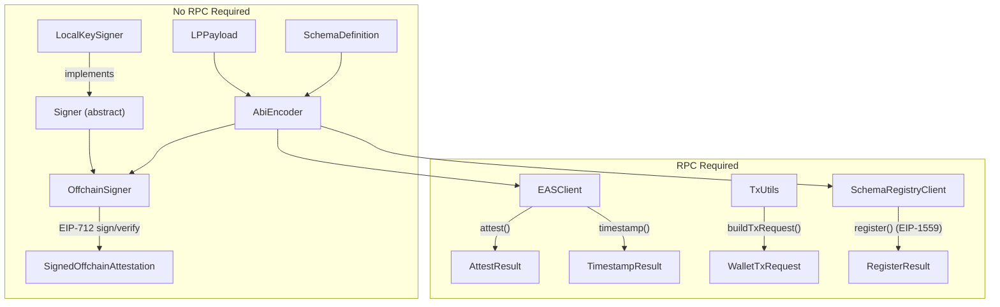

[](https://pub.dev/packages/location_protocol)
[](https://dart.dev)
[](https://opensource.org/licenses/BSD-3-Clause)
[](https://github.com/DecentralizedGeo/location-protocol-dart/actions)

> Dart library for building cryptographically verifiable, Location Protocol compliant records on top of your own data model.

---

## Contents

- [Description](#description)
- [Library targets](#library-targets)
- [Features](#features)
- [How It Works](#how-it-works)
- [Supported Chains](#supported-chains)
- [Installation](#installation)
- [Quick Start](#quick-start)
- [Architecture](#architecture)
- [Documentation](#documentation)
- [Help & Contributing](#help--contributing)
- [License](#license)

## Description

`location_protocol` is a Dart library that implements the [Location Protocol](https://spec.decentralizedgeo.org/introduction/overview/) (LP) base data model and signing rules as an extensible framework you can layer onto your own data model. It follows the implementation‑agnostic Location Protocol specification to build LP–compliant, cryptographically verifiable location records that can be used on Ethereum and EVM‑compatible networks.

In this reference implementation, LP payloads are embedded in [EAS (Ethereum Attestation Service)](https://docs.attest.org/docs/core--concepts/how-eas-works) attestations, giving you Ethereum‑style EIP‑712 signing and onchain anchoring while keeping the LP payload format portable to other runtimes that implement the same spec. The library covers the full lifecycle: location validation, payload construction, schema composition, ABI encoding, offchain signing, and onchain EAS operations.

The library supports both offchain ([EIP‑712](https://eips.ethereum.org/EIPS/eip-712), no gas) and onchain ([EIP‑1559](https://eips.ethereum.org/EIPS/eip-1559)) attestations, giving you a flexible spectrum from fully local signatures to immutably anchored on‑chain records.

This library provides the Dart equivalent of the signature service layer in the [Astral SDK](https://github.com/DecentralizedGeo/astral-sdk), adapted for mobile and multi‑platform Dart deployments. Pure Dart — no Flutter dependency; works in CLI, servers, Flutter apps, and all major compilation targets (web via JS/Wasm, Android, iOS, macOS, Windows, Linux).

---

## Library targets

This library is built with **Pure Dart** (no Flutter dependency). It is tested across all major compilation targets:

| Target | Status | Note |
| --- | --- | --- |
| **Android / iOS** | ✅ | Works in Flutter apps and CLI |
| **Windows / macOS / Linux** | ✅ | Native desktop and server-side |
| **Web (JS / Wasm)** | ✅ | Browser-compatible (via `blockchain_utils`) |
| **Server / CLI** | ✅ | Works in any Dart runtime |

---

## Features

- **LP payload creation and validation** — enforces the 4 base fields (`lp_version`, `srs`, `location_type`, `location`) on construction; location values are validated against canonical formats *before* any signing step
- **9 canonical location type validators** — GeoJSON geometries (`geojson-point`, `geojson-line`, `geojson-polygon`), H3, geohash, WKT, address, coordinate-decimal, and scaled coordinates
- **Extend your own data model** — define your business-specific fields; LP base fields are auto-prepended, producing LP-compliant records without restructuring your existing schema
- **Deterministic schema UID computation** — matches the on-chain EAS Schema Registry result (`keccak256(schemaString, resolverAddress, revocable)`)
- **ABI encoding of LP payload + user schema data** — produces the exact byte layout expected by EAS contracts
- **EIP-712 Version 2 offchain signing and verification** — CSPRNG salt, no RPC needed; fully portable, cryptographically verifiable attestations
- **Onchain schema registration, attestation, and offchain UID timestamping** — via EIP-1559 transactions through `EASClient` and `SchemaRegistryClient`
- **Extensible custom location type registration** — add your own validators via `LocationValidator.register()`

---

## How It Works

### Location validation before signing

Before any cryptographic signing occurs, every `LPPayload` validates its `location` value against the declared `location_type`. This means invalid or malformed coordinates are caught at construction time — not silently embedded in a signed record. Consumers verifying the attestation can therefore trust both the cryptographic signature *and* the spatial integrity of the location data. You can also register custom validators to enforce domain-specific location constraints before records are signed.

### Location Protocol payloads

Every attestation carries 4 base fields — `lp_version`, `srs`, `location_type`, and `location` — that come from the Location Protocol base data model and guarantee spatial interoperability across any schema and consumer. These fields are defined by the [LP base data model spec](https://spec.decentralizedgeo.org/specification/data-model/), and in this reference implementation they are wrapped inside an EAS attestation envelope without changing the LP payload format itself. The `LPPayload` class enforces them on construction: you cannot accidentally omit or misspell them. Location values are validated against canonical formats and serialized to strings by `LocationSerializer` before being encoded into the EAS payload.

### Building LP-compliant records on your data model

You define your existing business fields (e.g., `uint256 timestamp`, `string memo`) as a list of `SchemaField` objects. `SchemaDefinition` accepts those fields and automatically prepends the 4 LP base fields, producing a fully LP-compliant EAS schema string. This means you extend your data model — not replace it — while gaining LP interoperability and cryptographic verifiability by construct


### EAS schemas and attestations

[EAS](https://docs.attest.org/docs/core--concepts/how-eas-works) structures attestations around ABI-encoded schemas identified by deterministic UIDs. A schema must be registered on-chain before it can be used for on-chain attestations; the UID is derived from `keccak256(schemaString, resolverAddress, revocable)`. This library computes that UID locally via `SchemaUID.computeSchemaUID(...)`, letting you predict and cache schema UIDs without any RPC calls.

### Schema-agnostic design

You define your business fields (e.g., `uint256 timestamp`, `string memo`) as a list of `SchemaField` objects. `SchemaDefinition` accepts those fields and automatically prepends the 4 LP base fields, producing a fully LP-compliant EAS schema string. This prevents accidental naming conflicts with LP fields and ensures every attestation you create is interoperable with any LP-aware indexer or verifier.

### Offchain vs onchain

Offchain attestations are [EIP-712](https://eips.ethereum.org/EIPS/eip-712) signed locally — zero gas cost, immediately portable, and verifiable by any Ethereum wallet or EAS SDK. Onchain attestations write the encoded attestation to the EAS contract on-chain, providing maximum immutability. A lightweight middle path is to sign offchain and then call `EASClient.timestamp()` to anchor the offchain UID on-chain — immutable proof of existence without storing the payload on-chain.

---

## Supported Chains

21 networks are supported out of the box — 14 mainnets and 7 testnets. See the full list with chain IDs and contract addresses in the [Environment configuration reference](doc/guides/reference-environment.md#chain-selection).

Addresses are sourced from `ChainConfig` and match the [official EAS deployment registry](https://github.com/ethereum-attestation-service/eas-contracts/).

---

## Installation

```yaml
dependencies:
  location_protocol: ^0.1.0
```

Then run:

```sh
dart pub get
```

---

## Quick Start

See the [example/main.dart](example/main.dart) for a complete, runnable demonstration.

> **Security:** Never hard-code a real private key. Use environment variables or a secrets manager in production. See [Environment configuration](docs/guides/reference-environment.md).

```dart
import 'package:location_protocol/location_protocol.dart';

Future<void> main() async {
  // 1. Define a schema with business-specific fields.
  //    LP base fields (lp_version, srs, location_type, location) are prepended automatically.
  final schema = SchemaDefinition(fields: [
    SchemaField(type: 'uint256', name: 'observedAt'),
    SchemaField(type: 'string', name: 'memo'),
    SchemaField(type: 'address', name: 'observer'),
  ]);

  // Print the full EAS schema string (LP fields + your fields)
  print(schema.toEASSchemaString());
  // => string lp_version,string srs,string location_type,string location,uint256 observedAt,string memo,address observer

  // 2. Create an LP payload with a GeoJSON point location.
  final payload = LPPayload(
    lpVersion: '0.1.0',
    srs: 'http://www.opengis.net/def/crs/OGC/1.3/CRS84',
    locationType: 'geojson-point',
    location: {'type': 'Point', 'coordinates': [-122.4194, 37.7749]},
  );

  // 3. Create an OffchainSigner targeting Sepolia.
  //    Replace with a real private key; never commit secrets.
  const privateKeyHex = 'YOUR_PRIVATE_KEY_HEX'; // 64 hex chars, no 0x prefix
  final addresses = ChainConfig.forChainId(11155111)!; // Sepolia

  final signer = OffchainSigner.fromPrivateKey(
    privateKeyHex: privateKeyHex,
    chainId: 11155111,
    easContractAddress: addresses.eas,
  );

  // 4. Sign the attestation offchain (EIP-712 typed data, no RPC needed).
  final signed = await signer.signOffchainAttestation(
    schema: schema,
    lpPayload: payload,
    userData: {
      'observedAt': BigInt.from(DateTime.now().millisecondsSinceEpoch ~/ 1000),
      'memo': 'Rooftop sensor reading',
      'observer': signer.signerAddress,
    },
  );

  print('UID: ${signed.uid}');
  print('Signer: ${signed.signer}');

  // 5. Verify the signed attestation locally.
  final result = signer.verifyOffchainAttestation(signed);
  assert(result.isValid, 'Attestation verification failed: ${result.reason}');
  print('Valid: ${result.isValid}');
  print('Recovered address: ${result.recoveredAddress}');

  // 6. Optional: timestamp the offchain UID on-chain for immutable anchoring.
  //
  // final rpc = DefaultRpcProvider(
  //   rpcUrl: 'https://sepolia.infura.io/v3/YOUR_KEY',
  //   privateKeyHex: privateKeyHex,
  //   chainId: 11155111,
  // );
  // final client = EASClient(provider: rpc);
  // final timestampResult = await client.timestamp(signed.uid);
  // print('Timestamped in tx: ${timestampResult.txHash}');
}
```

---

## Architecture



---

## Documentation

- [Getting started tutorial](doc/guides/tutorial-first-attestation.md)
- [Tutorial: Sign with a wallet signer](doc/guides/tutorial-wallet-signer.md)
- [How to register and attest onchain](doc/guides/how-to-register-and-attest-onchain.md)
- [How to build a wallet-based onchain transaction](doc/guides/how-to-wallet-onchain-transactions.md)
- [How to add a custom location type](doc/guides/how-to-add-custom-location-type.md)
- [Environment configuration reference](doc/guides/reference-environment.md)
- [API reference](doc/guides/reference-api.md)
- [Concepts and design](doc/guides/explanation-concepts.md)

---

## Help & Contributing

- **Found a bug?** Open an [issue](https://github.com/DecentralizedGeo/location-protocol-dart/issues).
- **Want to contribute?** See [CONTRIBUTING.md](CONTRIBUTING.md).
- **Need help?** Check the [Documentation](#documentation) or start a discussion in the repository.

---

## License

MIT © DecentralizedGeo contributors. See [LICENSE](LICENSE) for details.
