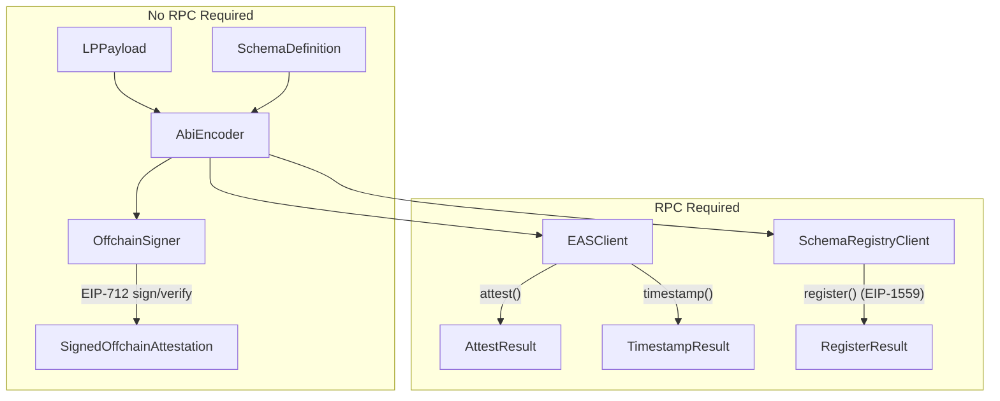

# location_protocol

[](https://pub.dev/packages/location_protocol)
[](https://dart.dev)
[](LICENSE)
[](https://github.com/DecentralizedGeo/location-protocol-dart/actions)

> Schema-agnostic Dart library for creating, signing, and verifying Location Protocol attestations on EAS.

---

## Description

`location_protocol` is a schema-agnostic Dart library implementing the [Location Protocol](https://spec.decentralizedgeo.org/introduction/overview/) base data model on top of [EAS (Ethereum Attestation Service)](https://docs.attest.org/docs/core--concepts/how-eas-works). It provides the full lifecycle for spatial attestations: payload construction, schema definition, ABI encoding, EIP-712 offchain signing, and onchain EAS operations.

The library supports both offchain ([EIP-712](https://eips.ethereum.org/EIPS/eip-712), no gas) and onchain ([EIP-1559](https://eips.ethereum.org/EIPS/eip-1559)) attestations, giving you a flexible spectrum from fully local signatures to immutably anchored on-chain records.

This library provides the Dart equivalent of the signature service layer in the [Astral SDK](https://github.com/DecentralizedGeo/astral-sdk), adapted for mobile and multi-platform Dart deployments, without hard-coding any particular schema. Pure Dart — no Flutter dependency; works in CLI, servers, Flutter apps, and all major compilation targets (web via JS/Wasm, Android, iOS, macOS, Windows, Linux).

---

## Features

- **LP payload creation and validation** — enforces the 4 base fields (`lp_version`, `srs`, `location_type`, `location`) on construction
- **9 canonical location type validators** — GeoJSON geometries (`geojson-point`, `geojson-line`, `geojson-polygon`), H3, geohash, WKT, address, coordinate-decimal, and scaled coordinates
- **Schema-agnostic composition** — define your own business fields; LP base fields are auto-prepended, guaranteeing LP compliance by construction
- **Deterministic schema UID computation** — matches the on-chain EAS Schema Registry result (`keccak256(schemaString, resolverAddress, revocable)`)
- **ABI encoding of LP payload + user schema data** — produces the exact byte layout expected by EAS contracts
- **EIP-712 Version 2 offchain signing and verification** — CSPRNG salt, no RPC needed; fully portable attestations
- **Onchain schema registration, attestation, and offchain UID timestamping** — via EIP-1559 transactions through `EASClient` and `SchemaRegistryClient`
- **Extensible custom location type registration** — add your own validators via `LocationValidator.register()`

---

## How It Works

### Location Protocol payloads

Every attestation carries 4 base fields — `lp_version`, `srs`, `location_type`, and `location` — that guarantee spatial interoperability across any schema and consumer. These fields are defined by the [LP base data model spec](https://spec.decentralizedgeo.org/specification/data-model/). The `LPPayload` class enforces them on construction: you cannot accidentally omit or misspell them. Location values are validated against 9 canonical formats and serialized to strings by `LocationSerializer`.

### EAS schemas and attestations

[EAS](https://docs.attest.org/docs/core--concepts/how-eas-works) structures attestations around ABI-encoded schemas identified by deterministic UIDs. A schema must be registered on-chain before it can be used for on-chain attestations; the UID is derived from `keccak256(schemaString, resolverAddress, revocable)`. This library computes that UID locally via `SchemaUID.computeSchemaUID(...)`, letting you predict and cache schema UIDs without any RPC calls.

### Schema-agnostic design

You define your business fields (e.g., `uint256 timestamp`, `string memo`) as a list of `SchemaField` objects. `SchemaDefinition` accepts those fields and automatically prepends the 4 LP base fields, producing a fully LP-compliant EAS schema string. This prevents accidental naming conflicts with LP fields and ensures every attestation you create is interoperable with any LP-aware indexer or verifier.

### Offchain vs onchain

Offchain attestations are [EIP-712](https://eips.ethereum.org/EIPS/eip-712) signed locally — zero gas cost, immediately portable, and verifiable by any Ethereum wallet or EAS SDK. Onchain attestations write the encoded attestation to the EAS contract on-chain, providing maximum immutability. A lightweight middle path is to sign offchain and then call `EASClient.timestamp()` to anchor the offchain UID on-chain — immutable proof of existence without storing the payload on-chain.

---

## Supported Chains

21 networks are supported out of the box — 14 mainnets and 7 testnets. See the full list with chain IDs and contract addresses in the [Environment configuration reference](docs/guides/reference-environment.md#chain-selection).

Addresses are sourced from `ChainConfig` and match the [official EAS deployment registry](https://github.com/ethereum-attestation-service/eas-contracts/).

---

## Installation

```yaml
dependencies:
  location_protocol: ^0.1.0
```

Then run:

```sh
dart pub get
```

---

## Quick Start

> **Security:** Never hard-code a real private key. Use environment variables or a secrets manager in production. See [Environment configuration](docs/guides/reference-environment.md).

```dart
import 'package:location_protocol/location_protocol.dart';

Future<void> main() async {
  // 1. Define a schema with business-specific fields.
  //    LP base fields (lp_version, srs, location_type, location) are prepended automatically.
  final schema = SchemaDefinition(fields: [
    SchemaField(type: 'uint256', name: 'observedAt'),
    SchemaField(type: 'string', name: 'memo'),
    SchemaField(type: 'address', name: 'observer'),
  ]);

  // Print the full EAS schema string (LP fields + your fields)
  print(schema.toEASSchemaString());
  // => string lp_version,string srs,string location_type,string location,uint256 observedAt,string memo,address observer

  // 2. Create an LP payload with a GeoJSON point location.
  final payload = LPPayload(
    lpVersion: '0.1.0',
    srs: 'http://www.opengis.net/def/crs/OGC/1.3/CRS84',
    locationType: 'geojson-point',
    location: {'type': 'Point', 'coordinates': [-122.4194, 37.7749]},
  );

  // 3. Create an OffchainSigner targeting Sepolia.
  //    Replace with a real private key; never commit secrets.
  const privateKeyHex = 'YOUR_PRIVATE_KEY_HEX'; // 64 hex chars, no 0x prefix
  final addresses = ChainConfig.forChainId(11155111)!; // Sepolia

  final signer = OffchainSigner(
    privateKeyHex: privateKeyHex,
    chainId: 11155111,
    easContractAddress: addresses.eas,
  );

  // 4. Sign the attestation offchain (EIP-712 typed data, no RPC needed).
  final signed = await signer.signOffchainAttestation(
    schema: schema,
    lpPayload: payload,
    userData: {
      'observedAt': BigInt.from(DateTime.now().millisecondsSinceEpoch ~/ 1000),
      'memo': 'Rooftop sensor reading',
      'observer': signer.signerAddress,
    },
  );

  print('UID: ${signed.uid}');
  print('Signer: ${signed.signer}');

  // 5. Verify the signed attestation locally.
  final result = signer.verifyOffchainAttestation(signed);
  assert(result.isValid, 'Attestation verification failed: ${result.reason}');
  print('Valid: ${result.isValid}');
  print('Recovered address: ${result.recoveredAddress}');

  // 6. Optional: timestamp the offchain UID on-chain for immutable anchoring.
  //
  // final rpc = DefaultRpcProvider(
  //   rpcUrl: 'https://sepolia.infura.io/v3/YOUR_KEY',
  //   privateKeyHex: privateKeyHex,
  //   chainId: 11155111,
  // );
  // final client = EASClient(provider: rpc);
  // final timestampResult = await client.timestamp(signed.uid);
  // print('Timestamped in tx: ${timestampResult.txHash}');
}
```

---

## Architecture



---

## Documentation

- [Getting started tutorial](docs/guides/tutorial-first-attestation.md)
- [How to register and attest onchain](docs/guides/how-to-register-and-attest-onchain.md)
- [How to add a custom location type](docs/guides/how-to-add-custom-location-type.md)
- [Environment configuration reference](docs/guides/reference-environment.md)
- [API reference](docs/guides/reference-api.md)
- [Concepts and design](docs/guides/explanation-concepts.md)

---

## License

MIT © DecentralizedGeo contributors. See [LICENSE](LICENSE) for details.
