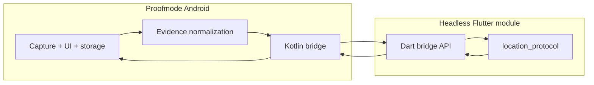
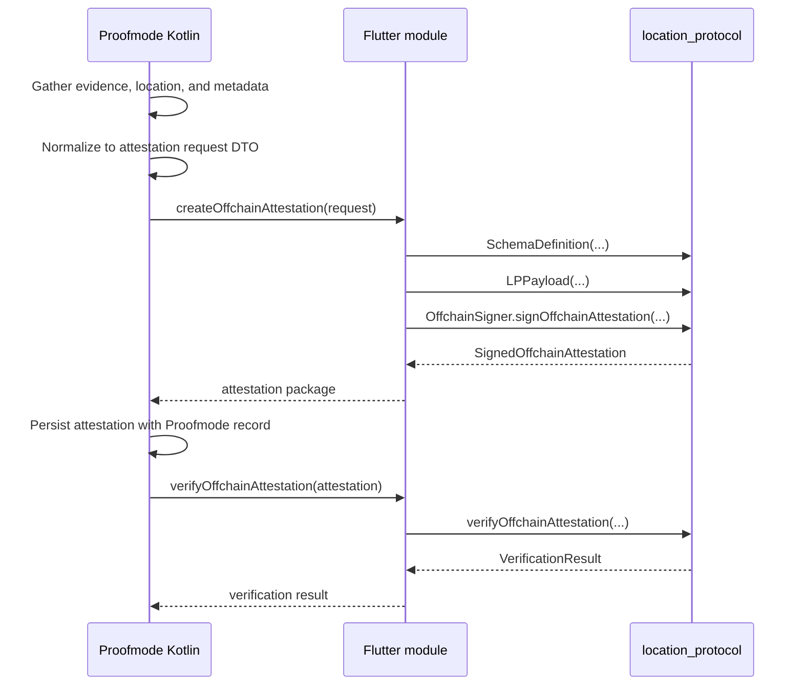

# How to integrate `location_protocol` with the Proofmode Android app

This guide describes the recommended way to use `location_protocol` inside the native [Proofmode Android app](https://github.com/guardianproject/proofmode-android): embed a **headless Flutter/Dart module** for attestation creation, keep the rest of the app native, and reserve a native Kotlin port for a later optimization pass.

The focus is the Proofmode workflow layer that creates Location Protocol attestations from already-collected evidence. This guide does **not** recommend moving Proofmode's camera, capture, storage, or UI flows into Flutter.

---

## Recommendation summary

### Short-term

Use a **headless Flutter module** with a narrow bridge API:

- `createOffchainAttestation`
- `verifyOffchainAttestation`
- `buildTimestampTransaction`
- optionally `buildOnchainAttestationTransaction`

This gives Proofmode the fastest path to production reuse because `location_protocol` is already **pure Dart** and the core offchain attestation flow runs fully offline.

### Long-term

If the Flutter engine footprint, bridge complexity, or operational overhead becomes a problem, port only the subset you actually use to Kotlin:

- LP payload validation
- schema composition
- ABI encoding
- EIP-712 typed data construction
- offchain UID computation
- signature verification

---

## Why the Flutter module approach fits this library

`location_protocol` has no Flutter dependency and is already designed around separable responsibilities:

- `LPPayload` validates the LP base fields before signing
- `SchemaDefinition` composes LP fields with app-specific fields
- `OffchainSigner` builds typed data, signs, verifies, and computes the UID
- `EASClient` and `TxUtils` support optional timestamp/onchain flows later

That means the attestation layer can live inside a Dart runtime without requiring a Flutter UI.

---

## Why this is not a drop-in Android library

Embedding the library through Flutter is viable, but it still adds:

- a Flutter engine inside a native Android app
- Android lifecycle management for a non-UI module
- serialization between Kotlin and Dart
- more background/offline state management
- APK size and startup overhead

So the complexity is mostly in the **native-to-Dart boundary**, not in the attestation logic.

---

## Recommended architecture



### Native Android responsibilities

Keep these in Proofmode's existing Kotlin code:

- capture workflow
- location gathering
- evidence hashing and metadata preparation
- local persistence
- background scheduling
- wallet integration or secure-key integration, if used

### Dart module responsibilities

Keep the Dart side narrowly scoped to:

- LP payload construction
- schema construction
- offchain attestation creation
- local attestation verification
- timestamp/onchain calldata building

---

## Recommended bridge surface

Treat the Flutter module as a small RPC-style service. The native app sends plain JSON-compatible maps and receives plain JSON-compatible maps.

### 1. `createOffchainAttestation`

Input:

```json
{
  "chainId": 11155111,
  "easContractAddress": "0x...",
  "schema": {
    "revocable": true,
    "resolverAddress": "0x0000000000000000000000000000000000000000",
    "fields": [
      { "type": "string", "name": "proofHash" },
      { "type": "uint256", "name": "observedAt" },
      { "type": "string", "name": "mediaType" }
    ]
  },
  "lpPayload": {
    "lpVersion": "1.0.0",
    "srs": "http://www.opengis.net/def/crs/OGC/1.3/CRS84",
    "locationType": "geojson-point",
    "location": {
      "type": "Point",
      "coordinates": [-73.9857, 40.7484]
    }
  },
  "userData": {
    "proofHash": "bafy...",
    "observedAt": "1744060800",
    "mediaType": "image/jpeg"
  },
  "recipient": "0x0000000000000000000000000000000000000000",
  "refUID": "0x0000000000000000000000000000000000000000000000000000000000000000",
  "expirationTime": "0",
  "signingMode": "local_key"
}
```

Output:

```json
{
  "uid": "0x...",
  "schemaUID": "0x...",
  "signer": "0x...",
  "recipient": "0x...",
  "time": "1744060800",
  "expirationTime": "0",
  "revocable": true,
  "refUID": "0x...",
  "salt": "0x...",
  "version": 2,
  "signature": {
    "v": 27,
    "r": "0x...",
    "s": "0x..."
  },
  "data": "0x..."
}
```

### 2. `verifyOffchainAttestation`

Input: a previously returned signed attestation object plus chain/EAS domain configuration.

Output:

```json
{
  "isValid": true,
  "recoveredAddress": "0x...",
  "reason": null
}
```

### 3. `buildTimestampTransaction`

Input:

```json
{
  "chainId": 11155111,
  "easContractAddress": "0x...",
  "uid": "0x..."
}
```

Output:

```json
{
  "to": "0x...",
  "data": "0x...",
  "value": "0x0"
}
```

### 4. `buildOnchainAttestationTransaction` (optional)

Input: the same schema, LP payload, and user data used for attestation creation.

Output: a wallet-ready transaction request built from `EASClient.buildAttestCallData(...)` and `TxUtils.buildTxRequest(...)`.

---

## DTO guidance

Use DTOs that mirror the public library API as closely as possible.

### Schema DTO

- `fields`: ordered list of `{type, name}`
- `revocable`
- `resolverAddress`

### LP payload DTO

- `lpVersion`
- `srs`
- `locationType`
- `location`

### Signed attestation DTO

Persist the full returned object, not just the UID. The UID alone is enough for `timestamp()`, but not enough for later verification or re-attestation.

### Integer and bytes encoding

Across the Kotlin↔Dart boundary:

- send big integers as decimal strings
- send addresses and byte arrays as `0x`-prefixed hex strings
- send maps/lists only when they are already JSON-safe

This matches the library's typed-data and calldata expectations.

---

## Signing strategy

This is the most important implementation decision.

### Option A — local signing in Dart

Use `OffchainSigner.fromPrivateKey(...)`.

Pros:

- easiest to implement
- minimal bridge complexity
- fastest path for a prototype

Cons:

- the app handles raw private key material
- weak fit for production mobile security

Use this only when the key-management risk is explicitly acceptable.

### Option B — native or wallet-backed signing

Use a custom `Signer` implementation.

Recommended flow:

1. Dart builds the EIP-712 typed data
2. Dart passes the typed data to Android
3. Android signs with a wallet or secure signing backend
4. Android returns `r`, `s`, and `v`
5. Dart finalizes the `SignedOffchainAttestation`

This keeps key control outside Dart and aligns with the `Signer` abstraction used by `OffchainSigner`.

---

## Proofmode attestation flow

The following sequence maps the library onto Proofmode's layer-5 attestation step.



### Suggested storage behavior

When Proofmode creates an attestation, persist:

- the full signed attestation object
- the schema string or schema UID
- the LP payload fields
- the application evidence identifiers that produced it
- any later timestamp/onchain transaction hashes

That gives you enough information to:

- verify locally later
- anchor the UID later
- re-attest onchain later if needed
- export the attestation as a portable artifact

---

## Phased implementation plan

### Phase 1 — offchain creation only

Ship only:

- `createOffchainAttestation`
- `verifyOffchainAttestation`

This is the cleanest fit for Proofmode's offline-first workflow.

### Phase 2 — timestamp anchoring

Add:

- `buildTimestampTransaction`

Use it when Proofmode is back online and wants an immutable proof-of-existence anchor for the offchain UID.

### Phase 3 — full onchain attestation

Add:

- `buildOnchainAttestationTransaction`

Use this only if you need the full payload stored in EAS, not just a timestamped UID.

### Phase 4 — native Kotlin reassessment

Reassess a Kotlin port only after you have production data on:

- Flutter engine startup cost
- APK growth
- bridge maintenance cost
- background execution reliability

---

## Complexity assessment

### Headless Flutter module, offchain only

**Complexity: medium**

- reuse is high
- implementation speed is good
- runtime overhead is acceptable for an integration-first release

### Flutter module plus timestamp/onchain support

**Complexity: medium-high**

- requires wallet or RPC integration strategy
- increases transaction-state handling
- still avoids reimplementing EAS/LP logic

### Native Kotlin port

**Complexity: high upfront**

- best native fit
- lowest runtime overhead
- highest initial implementation and verification cost

---

## Practical recommendation for Proofmode

If you are integrating today, use this sequence:

1. Create a headless Flutter module dedicated to Proofmode layer 5
2. Expose only `createOffchainAttestation` and `verifyOffchainAttestation`
3. Keep Proofmode's UI, capture, and persistence fully native
4. Add timestamp support only after the offchain path is stable
5. Revisit a Kotlin port only if the Flutter boundary becomes the bottleneck

This is the fastest path to production reuse while keeping the architecture reversible.

---

## Related documentation

- [Build your first Location Protocol attestation](tutorial-first-attestation.md)
- [Sign attestations with an external wallet signer](tutorial-wallet-signer.md)
- [How to build a wallet-based onchain transaction](how-to-wallet-onchain-transactions.md)
- [Concepts and design](explanation-concepts.md)
- [API reference](reference-api.md)
