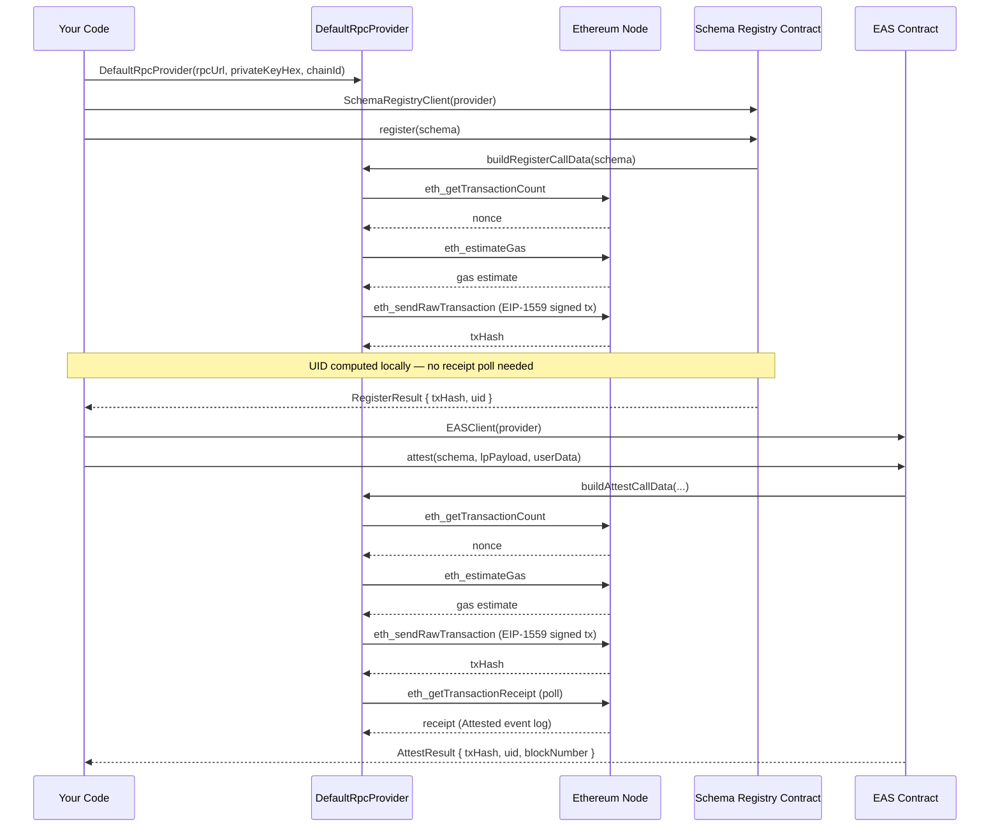

# How to register a schema and attest onchain

This guide shows how to anchor an implementation-agnostic Location Protocol payload onto an EVM network using the EAS reference implementation. It assumes you have completed the [getting started tutorial](tutorial-first-attestation.md) and have an RPC endpoint and funded Ethereum account. See [Prerequisites](#prerequisites) before starting.

---

## Prerequisites

- Dart ≥ 3.11
- `location_protocol` added to `pubspec.yaml`
- An RPC endpoint URL (e.g. Alchemy, Infura, or a public RPC)
- A funded Ethereum account private key (for gas)
- A `SchemaDefinition` and `LPPayload` ready (from [the tutorial](tutorial-first-attestation.md))

---

## Transaction lifecycle

The diagram below shows the full async RPC lifecycle for both operations. Note that schema registration does **not** poll for a receipt — the UID is deterministic and computed locally.



---

## Step 1 — Set up your RPC provider

```dart
import 'dart:io';
import 'package:location_protocol/location_protocol.dart';

void main() async {
  // Load from environment variables — never hard-code credentials
  final rpcUrl = Platform.environment['EAS_RPC_URL']
      ?? (throw Exception('EAS_RPC_URL not set'));
  final privateKey = Platform.environment['EAS_PRIVATE_KEY']
      ?? (throw Exception('EAS_PRIVATE_KEY not set'));

  const chainId = 11155111; // Sepolia

  final provider = DefaultRpcProvider(
    rpcUrl: rpcUrl,
    privateKeyHex: privateKey,
    chainId: chainId,
  );
}
```

See [Environment configuration reference](reference-environment.md) for how to set these variables.

---

## Step 2 — Define your schema and LP payload

Even though this guide assumes you already have a `SchemaDefinition` and `LPPayload` from the tutorial, you need them in scope here. Add the following inside `main`, after the provider setup:

```dart
  final schema = SchemaDefinition(
    fields: [
      SchemaField(type: 'uint256', name: 'timestamp'),
      SchemaField(type: 'string', name: 'memo'),
    ],
  );

  final lpPayload = LPPayload(
    lpVersion: '1.0.0',
    srs: 'http://www.opengis.net/def/crs/OGC/1.3/CRS84',
    locationType: 'geojson-point',
    location: {'type': 'Point', 'coordinates': [-103.771556, 44.967243]},
  );
```

See [Step 1](tutorial-first-attestation.md#step-1--define-your-schema) and [Step 2](tutorial-first-attestation.md#step-2--create-an-lp-payload) of the tutorial for full details on these types.

---

## Step 3 — Register the schema

```dart
  final registryClient = SchemaRegistryClient(provider: provider);

  // Compute the UID locally before registering
  final expectedUID = SchemaRegistryClient.computeSchemaUID(schema);
  print('Expected schema UID: $expectedUID');

  // Register on-chain (or reuse an existing UID if already registered)
  final registerResult = await registryClient.register(schema);
  print('Schema registered: ${registerResult.uid}');
  print('Transaction: ${registerResult.txHash}');
```

> **Note:** `register()` automatically checks whether the schema already exists before sending a transaction. If it does, the call returns immediately with a `null` `txHash` — no gas is spent. You can branch on this:
>
> ```dart
> if (registerResult.txHash == null) {
>   print('Schema already on-chain — reusing UID: ${registerResult.uid}');
> } else {
>   print('Registered: ${registerResult.txHash}');
> }
> ```
>
> **Note:** When a new registration is submitted, `register()` broadcasts the transaction and returns immediately — it does not wait for the transaction to be mined. The UID is computed locally. If you need confirmation the transaction was mined before proceeding, poll `provider.waitForReceipt(registerResult.txHash!)` manually.

---

## Step 4 — Attest onchain

```dart
  final easClient = EASClient(provider: provider);

  final attestResult = await easClient.attest(
    schema: schema,
    lpPayload: lpPayload,
    userData: {
      'timestamp': BigInt.from(DateTime.now().millisecondsSinceEpoch ~/ 1000),
      'memo': 'Onchain field survey checkpoint',
    },
  );

  print('Attestation UID:   ${attestResult.uid}');
  print('Transaction hash:  ${attestResult.txHash}');
  print('Block number:      ${attestResult.blockNumber}');
```

Unlike `register()`, `attest()` polls for a receipt and extracts the UID from the `Attested` event log before returning. The call resolves only after the transaction is mined.

Optional parameters: `recipient` (defaults to the zero address), `expirationTime` (`BigInt`), and `refUID` (`String`).

---

## Step 5 — (Optional) Timestamp an offchain attestation

If you have an existing `SignedOffchainAttestation` from `OffchainSigner`, you can anchor it onchain at low cost:

```dart
  // Assumes `signed` is a SignedOffchainAttestation from OffchainSigner
  final timestampResult = await easClient.timestamp(signed.uid);

  print('Timestamped UID:  ${timestampResult.uid}');
  print('Block timestamp:  ${timestampResult.time}');
  print('Transaction hash: ${timestampResult.txHash}');
```

`TimestampResult.time` is a `BigInt` containing the `block.timestamp` (Unix seconds) at which the anchoring was recorded.

---

## What's next

- [Environment configuration reference](reference-environment.md)
- [API reference — EASClient](reference-api.md#easclient)
- [API reference — SchemaRegistryClient](reference-api.md#schemaregistryclient)
- [Concepts: Offchain vs onchain attestations](explanation-concepts.md#4-offchain-vs-onchain-attestations)
