## Visualizing the Workflow

The [Location Protocol's](https://spec.decentralizedgeo.org/introduction/overview/) **Signature Service** boils down to four discrete cryptographic operations:

| Operation | What It Does |
|-----------|-------------|
| **ABI Encoding** | Encodes attestation fields per the EAS schema |
| **EIP-712 Hashing** | Creates a typed, structured hash of the attestation |
| **secp256k1 Signing** | Signs the hash with user's Ethereum private key |
| **Signature Verification** | Recovers signer address from signature |

Below is a sequence diagram that illustrates the full offline → online workflow of the [EAS SDK](https://github.com/ethereum-attestation-service/eas-sdk/), including the key steps and what each party (i.e. attester and relayer) can infer at each stage.

> [!NOTE]
> The attester and relayer roles are used here for illustrative purposes, but in practice the same user could perform both roles (i.e. signing offline and submitting online). The diagram focuses on the logical flow of data and operations rather than strict role separation.

```mermaid
sequenceDiagram
    autonumber

    actor Attester
    participant LocalStore as Local Storage
    participant OffchainSDK as Offchain (SDK)
    participant OnchainSDK as EAS (SDK)
    participant EASContract as EAS Contract (Onchain)

    rect rgb(220, 240, 255)
        Note over Attester, OffchainSDK: 📴 OFFLINE PHASE — No network connection required

        Attester->>OffchainSDK: eas.getOffchain()
        OffchainSDK-->>Attester: Offchain instance

        Note over Attester, OffchainSDK: Encode schema data with SchemaEncoder
        Attester->>OffchainSDK: offchain.signOffchainAttestation(params, signer)<br/>{ schema, recipient, time, expirationTime,<br/>revocable, refUID, data }
        Note over OffchainSDK: Auto-generates random salt (Version2)<br/>Signs EIP-712 typed data with private key<br/>(no RPC call needed)
        OffchainSDK->>OffchainSDK: Offchain.getOffchainUID(version, schema,<br/>recipient, ZERO_ADDRESS, time,<br/>expirationTime, revocable, refUID,<br/>data, salt)
        OffchainSDK-->>Attester: SignedOffchainAttestation<br/>{ uid, sig, message, version }

        Attester->>Attester: Build AttestationShareablePackageObject<br/>{ sig: SignedOffchainAttestation,<br/>  signer: attesterAddress }

        Attester->>Attester: zipAndEncodeToBase64(pkg)<br/>→ gzip compress + Base64 encode<br/>(bigint-safe serialization)

        Attester->>LocalStore: Save encoded string<br/>keyed by offchain UID
        LocalStore-->>Attester: ✅ Saved
    end

    Note over Attester, EASContract: 〰️ Time passes — attester regains connectivity

    rect rgb(220, 255, 220)
        Note over Attester, EASContract: 📶 ONLINE PHASE — Network connection restored

        Attester->>LocalStore: Load all saved encoded attestations
        LocalStore-->>Attester: encoded Base64 string(s)

        Attester->>Attester: decodeBase64ZippedBase64(encoded)<br/>→ AttestationShareablePackageObject

        rect rgb(255, 255, 200)
            Note over Attester, OffchainSDK: 🔍 OPTIONAL: Verify signature integrity before spending gas
            Attester->>OffchainSDK: new Offchain(config, Version2, eas)
            Attester->>OffchainSDK: offchain.verifyOffchainAttestationSignature<br/>(pkg.signer, pkg.sig)
            Note over OffchainSDK: Recomputes offchain UID from message fields<br/>Checks uid == recomputed UID<br/>Verifies EIP-712 signature against attester address
            OffchainSDK-->>Attester: ✅ true (valid) / ❌ false (invalid)
        end

        Attester->>OnchainSDK: eas.connect(signerWithProvider)

        alt Single attestation
            Attester->>OnchainSDK: eas.attest({<br/>  schema: sig.message.schema,<br/>  data: {<br/>    recipient: sig.message.recipient,<br/>    expirationTime: sig.message.expirationTime,<br/>    revocable: sig.message.revocable,<br/>    refUID: sig.uid,  ← offchain UID<br/>    data: sig.message.data ← full payload<br/>  }<br/>})
        else Batch — multiple queued attestations
            Attester->>OnchainSDK: eas.multiAttest([{<br/>  schema,<br/>  data: [<br/>    { ...pkg1, refUID: pkg1.sig.uid },<br/>    { ...pkg2, refUID: pkg2.sig.uid },<br/>    ...<br/>  ]<br/>}])
        end

        Note over OnchainSDK: Populates contract transaction<br/>with full data payload + refUID

        OnchainSDK->>EASContract: attest() / multiAttest()<br/>broadcast transaction

        Note over EASContract: Derives onchain UID:<br/>keccak256(schema, recipient, msg.sender,<br/>block.timestamp, expirationTime,<br/>revocable, refUID, data, bump)<br/><br/>Stores full attestation struct onchain:<br/>{ uid, schema, refUID ← offchain UID,<br/>  time ← block.timestamp, attester,<br/>  recipient, data, revocable, ... }

        EASContract-->>OnchainSDK: Attested event { uid }
        OnchainSDK-->>Attester: onchainUID (new UID)

        Attester->>Attester: Record mapping:<br/>offchainUID (sig.uid) ��� onchainUID
    end

    rect rgb(255, 235, 220)
        Note over Attester, EASContract: 🔎 VERIFICATION PHASE — Anyone can verify the full chain of custody

        actor Verifier
        Verifier->>EASContract: eas.getAttestation(onchainUID)
        EASContract-->>Verifier: Attestation {<br/>  uid: onchainUID,<br/>  schema,<br/>  refUID: offchainUID, ← link to origin<br/>  attester,<br/>  data: full payload,<br/>  time: block.timestamp,<br/>  ...<br/>}

        Note over Verifier: refUID !== ZERO_BYTES32<br/>→ infer attestation originated offline

        Verifier->>LocalStore: Load saved package by refUID (offchainUID)
        LocalStore-->>Verifier: encoded Base64 string
        Verifier->>Verifier: decodeBase64ZippedBase64(encoded)<br/>→ AttestationShareablePackageObject

        Verifier->>Verifier: Recompute offchain UID:<br/>Offchain.getOffchainUID(version, schema,<br/>recipient, ZERO_ADDRESS, time, expirationTime,<br/>revocable, refUID, data, salt)

        Verifier->>Verifier: Assert recomputedUID == onchainAttestation.refUID ✅
        Verifier->>Verifier: Assert pkg.sig.message.data == onchainAttestation.data ✅
        Verifier->>Verifier: Assert pkg.signer == onchainAttestation.attester ✅

        Verifier->>OffchainSDK: offchain.verifyOffchainAttestationSignature<br/>(pkg.signer, pkg.sig)
        OffchainSDK-->>Verifier: ✅ Signature valid — full chain of custody confirmed
    end
```

Here's a breakdown of the three phases and what each step proves:

---

### 📴 Offline Phase (Steps 1–9)
- No RPC or network call is made — everything runs locally against the signer's private key
- `signOffchainAttestation` generates a random `salt` (Version2), signs the EIP-712 typed data, and derives the offchain UID using `ZERO_ADDRESS` as the attester placeholder
- `zipAndEncodeToBase64` handles `bigint` serialization safely and compresses for compact storage

### 📶 Online Phase (Steps 10–19)
- `decodeBase64ZippedBase64` fully reconstructs the `AttestationShareablePackageObject`
- The optional signature verification step catches any corruption before spending gas
- `refUID: sig.uid` is the critical link — the offchain UID is passed as the onchain attestation's reference, stored permanently in the EAS contract
- The onchain UID **will differ** (derives from `msg.sender` + `block.timestamp`, not `ZERO_ADDRESS` + offchain `time`)

### 🔎 Verification Phase (Steps 20–28)
- Any verifier can fetch the onchain attestation, see `refUID !== ZERO_BYTES32`, and infer an offline origin
- The chain of custody is closed by: recomputing the offchain UID from the saved package → confirming it matches `refUID` → verifying the EIP-712 signature → confirming `data` and `attester` are consistent between both records

---

## Framework agnostic breakdown

The following flowchart abstracts away from the specific SDK methods and focuses on the core cryptographic operations and data transformations that occur at each step of the workflow. This can be useful for understanding the underlying mechanics without being tied to a particular implementation.

```mermaid
---
config:
  flowchart:
    curve: basis
    diagramPadding: 20
    width: 1200
  theme: mc
---
%%{init: {"flowchart": {"curve": "basis"}}}%%
flowchart TB
    START([BEGIN])

    %% ---------------- OFFLINE PHASE ----------------
    subgraph OFFLINE["📴 OFFLINE PHASE — No network required"]
        direction LR

        A1[Define schema structure]
        A2[Encode data payload]
        %% note: Serialize according to schema definition
        A3[Assemble attestation params]

        B1[Generate random salt]
        %% note: Cryptographically random; ensures unique UID for identical inputs
        B2[Construct typed data]
        B3[Sign with private key]
        %% note: Offline signing — no network call required
        B4[Derive offchain UID]
        %% note: UID derived from all parameters + salt, ensures uniqueness and integrity link

        C1[Bundle signed attestation]
        %% note: Combine signature, parameters, UID, and signer address
        C2[Serialize package]
        %% note: Preserve data types; compress if needed
        C3[(Save locally by UID)]
        %% note: Persistent local storage keyed by offchain UID

        A1 --> A2 --> A3 --> B1 --> B2 --> B3 --> B4 --> C1 --> C2 --> C3
    end

    %% ---------------- ONLINE PHASE ----------------
    subgraph ONLINE["📶ONLINE PHASE — Connectivity restored"]
        direction LR

        D1[(Read saved package)]
        D2[Deserialize contents]
        %% note: Restore all original fields, including binary and large integers

        E1[Recompute offchain UID]
        E2{UID matches?}
        E3[Verify stored signature]
        E4{Signature valid?}
        ABORT([ABORT — Data invalid])
        %% note: Abort submission if UID mismatch or signature invalid

        F1[Assemble onchain attestation]
        F2[Set refUID = offchain UID]
        %% note: Creates permanent link between offchain & onchain versions
        F3[Broadcast transaction]
        F4[Capture onchain UID]
        F5[Link offchain ↔ onchain UID]

        D1 --> D2 --> E1 --> E2
        E2 -->|No| ABORT
        E2 -->|Yes| E3 --> E4
        E4 -->|No| ABORT
        E4 -->|Yes| F1 --> F2 --> F3 --> F4 --> F5
    end

    %% ---------------- CONFIRMATION PHASE ----------------
    subgraph CONFIRM["✅&nbsp;CONFIRMATION&nbsp;—&nbsp;Chain&nbsp;of&nbsp;custody&nbsp;established"]
        direction LR

        G1[Fetch onchain record]
        G2[Check refUID exists]
        G3[Confirm data consistency]
        G4[Verify attester address]
        G5([COMPLETE — Chain verified])
        %% note: Attestation integrity confirmed end-to-end

        G1 --> G2 --> G3 --> G4 --> G5
    end

    %% --- link the major groups in a single vertical chain ---
    START --> OFFLINE --> ONLINE --> CONFIRM

    %% ---------------- STYLING ----------------
    style OFFLINE fill:#f9f9f9,stroke:#bbb,stroke-width:1px
    style ONLINE fill:#eef5ff,stroke:#88a,stroke-width:1px
    style CONFIRM fill:#e9ffe9,stroke:#8a8,stroke-width:1px
    style ABORT fill:#fdd,stroke:#a33,stroke-width:1px
```

---

## Hard Requirements

### Cryptographic & Technical Requirements

| # | Requirement | Standard / Capability | Why It Is Required |
|---|---|---|---|
| 1 | **Structured typed data signing** | EIP-712 | Attestation signatures must be produced over a canonically structured, human-readable typed message — not raw bytes. This ensures the signer knows exactly what they are signing, enables wallet-level display of the data, and makes the signature verifiable by any EIP-712-compatible tool without SDK coupling. |
| 2 | **Deterministic UID derivation (offchain)** | `keccak256` packed hash over a fixed field set: `version · schema · recipient · ZERO_ADDRESS · time · expirationTime · revocable · refUID · data · salt` | The offchain UID must be reproducible by anyone given the same inputs. This is what allows the `refUID` link to be independently verified — any party can recompute the UID from the restored package and confirm it matches the value stored onchain. `ZERO_ADDRESS` is used as the attester placeholder specifically to make the offchain UID computable without knowing who will eventually submit it onchain. |
| 3 | **Cryptographically random salt** | CSPRNG (Cryptographically Secure Pseudo-Random Number Generator), 32 bytes | The salt makes every offchain UID unique even when all other attestation parameters are identical. Without it, two attestations with the same schema, recipient, and data would produce the same UID, making them indistinguishable and enabling replay or collision attacks. |
| 4 | **Deterministic UID derivation (onchain)** | `keccak256` packed hash over: `schema · recipient · attester (msg.sender) · block.timestamp · expirationTime · revocable · refUID · data · bump` | The onchain UID is computed by the contract itself using the actual submitter address and block timestamp — inputs that are not known at offline signing time. This is why the offchain and onchain UIDs structurally cannot match, and why `refUID` is the correct linking mechanism rather than UID identity. |
| 5 | **Private key signing without network access** | ECDSA over secp256k1 | The core offline-first property depends on the ability to produce a valid cryptographic signature using only the private key, with no RPC call, provider, or chain state required. Any implementation must support fully local signing. |
| 6 | **Signature verification** | EIP-712 signature recovery (`ecrecover` / equivalent) | Before submitting, the restored signature must be verifiable against the attester's address to confirm the data has not been tampered with in storage. This requires recovering the signer address from the signature and comparing it to the expected attester. |
| 7 | **Lossless serialization of large integers** | Application-level bigint-safe encoding (e.g. converting `uint64`/`uint256` to strings before JSON, or using a binary format) | Ethereum values such as timestamps, expiry times, and chain IDs exceed JavaScript's safe integer range (`2^53 - 1`). Standard `JSON.stringify` silently corrupts these values. The serialization layer must explicitly handle large integers to guarantee the restored package produces the same UID as the original. |
| 8 | **Schema field encoding** | ABI encoding (Solidity ABI specification) | The data payload must be encoded according to the ABI types declared in the schema (e.g. `uint256`, `address`, `bytes32`). Incorrect encoding produces a different binary payload, which changes the UID and makes the attestation unverifiable against the schema definition. |
| 9 | **`refUID` as an onchain link** | EAS contract `refUID` field (native `bytes32` field on every attestation) | `refUID` is the only native EAS mechanism for linking one attestation record to another. By storing the offchain UID in this field, the link becomes a permanent, immutable part of the onchain record — no schema change is required, and the field is returned by the contract on every attestation fetch. |
| 10 | **Replay protection for delegated submission** | EIP-712 nonce + optional deadline | If the submission is made via a delegated flow (a separate party submits on behalf of the original signer), a nonce scoped to the signer's address must be included in the signed message. This prevents the same signed delegation from being resubmitted more than once. An optional deadline provides a time-bound expiry on the delegation. |
| 11 | **Chain ID binding** | EIP-712 domain separator (`chainId` field) | The signed message must include the target chain's ID. This prevents a signature produced for one network (e.g. a testnet) from being replayed on another (e.g. mainnet). The chain ID is embedded in the EIP-712 domain separator. |
| 12 | **Contract address binding** | EIP-712 domain separator (`verifyingContract` field) | The address of the EAS registry contract must be included in the domain separator. This ensures a signature is valid only for that specific contract deployment and cannot be replayed against a different contract on the same chain. |

---

## Failure Modes & Expected Handling

| Failure | When It Occurs | Expected Handling |
|---|---|---|
| **UID mismatch after restore** | Recomputed offchain UID does not match the stored UID after deserializing from local storage | Abort submission. Indicates storage corruption or an incomplete write. Do not submit — the data cannot be trusted. Attempt to reload from a backup if available. |
| **Invalid signature on restore** | Signature verification fails against the stored attester address | Abort submission. The attestation parameters or signature bytes were modified after signing. The package should be discarded — it cannot be proven to be the original attester's intent. |
| **Serialization data loss** | Large integer fields (timestamps, chain ID) are silently truncated during save/load | Silent corruption — the UID recomputation will fail, catching it. Prevented by enforcing bigint-safe serialization at the save step. |
| **Wrong chain on submission** | Signer's wallet or provider is connected to a different chain than the one the attestation was signed for | The contract will reject the transaction or produce an unverifiable record. Validate that the connected chain ID matches `sig.domain.chainId` before broadcasting. |
| **Nonce mismatch (delegated flow only)** | The nonce used when signing the delegation has already been consumed by a prior transaction | The contract will reject the transaction. Fetch the current nonce at submission time and re-sign the delegation with the updated nonce before resubmitting. |
| **Transaction failure (gas / revert)** | Onchain submission is rejected by the contract | The offchain package remains valid in local storage. Retry the submission. The offchain UID is unaffected — the same package can be resubmitted. |
| **Lost local storage** | The device loses the saved package before onchain submission | The offchain attestation is unrecoverable if the package was not backed up elsewhere. The offchain UID has never been submitted, so there is no onchain record. Prevention: replicate the serialized package to a secondary store (cloud backup, secondary device) immediately after signing. |
| **Submitter address mismatch (delegated flow only)** | The wallet used to broadcast is not the intended attester and no delegation signature was prepared | The onchain record will record the wrong attester address. Always verify `onchainAttestation.attester == pkg.signer` in the confirmation step to catch this. |

---

> **Note on third-party verification:** Any independent verifier who holds a copy of the serialized offchain package and the onchain UID can run the same confirmation steps (recompute offchain UID → compare to `refUID` → verify signature → compare data and attester) using only the EIP-712 specification and the chain's public state. No access to the original attester's keys or SDK is required.
