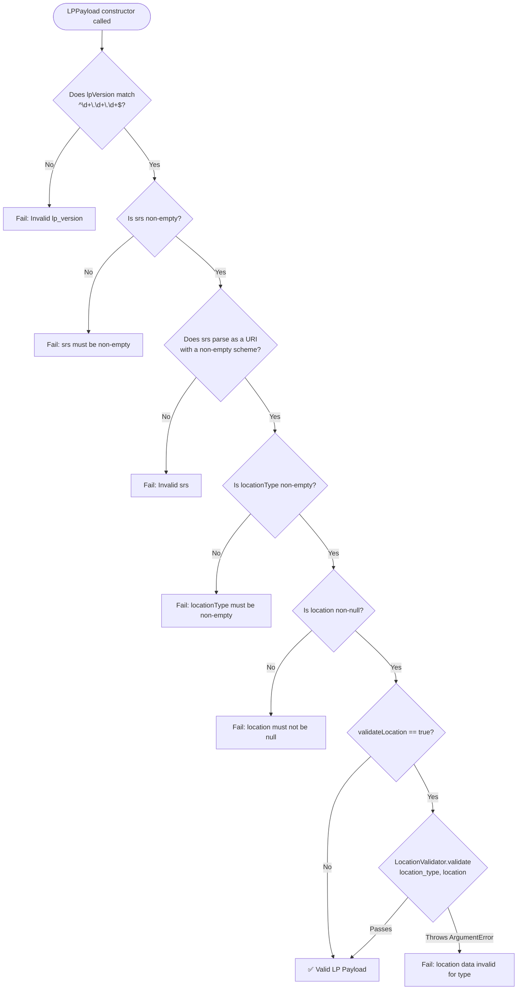
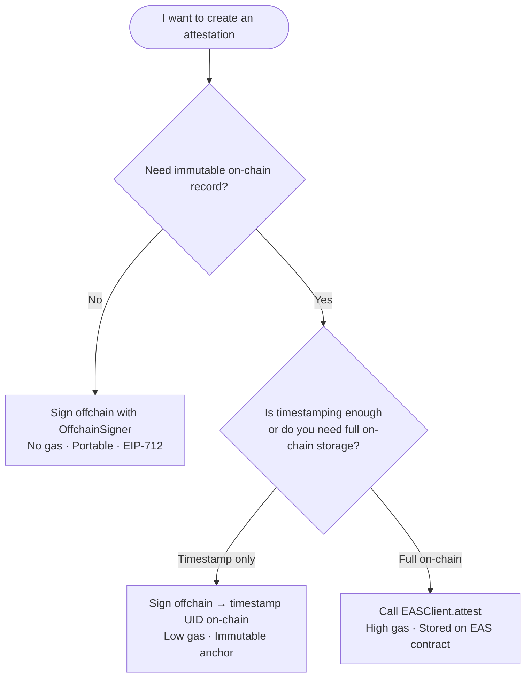

# Understanding location_protocol — Concepts and Design

This document explains the architectural ideas and design choices behind `location_protocol`. It is not a tutorial or how-to guide; it is meant to help you build an accurate mental model of how the library works and why it is shaped the way it is.

---

## 1. The Location Protocol Payload

Every attestation produced by `location_protocol` is anchored to the [LP base data model spec](https://spec.decentralizedgeo.org/specification/data-model/), which mandates four fields that must appear in every LP-compliant attestation: `lp_version`, `srs`, `location_type`, and `location`. These four fields form the immutable core around which any custom application schema is built. Understanding what each one means is foundational to understanding how the library works.

`lp_version` is a three-part numeric version string matching the pattern `major.minor.patch` (e.g. `"1.0.0"`) that identifies which revision of the Location Protocol specification governs the interpretation of the other fields. It resembles semver but is stricter: pre-release labels such as `"1.0.0-beta"` are not accepted — only strings that match `^\d+\.\d+\.\d+$` are valid. Versioning at the payload level means that a verifier reading an attestation years from now can determine exactly which rules were in effect when the data was encoded, without relying on when the schema itself was registered.

`srs` is a [Spatial Reference System](https://spec.decentralizedgeo.org/specification/data-model/#field-definitions-and-constraints) URI that specifies the coordinate reference framework for all spatial values in `location`. It must be a fully-qualified URI, such as `"http://www.opengis.net/def/crs/EPSG/0/4326"`. The LP spec explicitly [deprecates legacy shorthand codes](https://spec.decentralizedgeo.org/appendices/srs/#deprecation-of-legacy-shorthand-codes) like `EPSG:4326` in this field — a shorthand is not a URI, and ambiguity over datum realizations makes shorthand unsafe for long-term provenance.

`location_type` is a non-empty string that tells any consumer how to parse the `location` field. It acts as a dispatch key: a value of `"geojson-point"` means the `location` field carries a GeoJSON Point object; `"h3"` means it carries an H3 cell index string. The [Location Types spec](https://spec.decentralizedgeo.org/specification/location-types/) maintains the full canonical registry of recognized values and their expected formats.

`location` is the actual spatial data. Its Dart type — `String`, `List`, or `Map` — depends entirely on `location_type`. A GeoJSON type delivers a `Map`; an H3 or geohash type delivers a `String`; a coordinate list delivers a `List<num>`. The field is intentionally typed as `dynamic` in the Dart model, with the actual structural checking delegated to `LocationValidator`.

The critical design insight is that validation happens at `LPPayload` **construction time**, before any data ever reaches the ABI encoder or the signer. An `LPPayload` instance that exists is, by definition, a valid LP payload — there is no separate `validate()` step to forget. The following diagram shows the full validation path:

---

## 2. EAS Schemas and Attestation UIDs

[EAS (Ethereum Attestation Service)](https://docs.attest.org/docs/core--concepts/how-eas-works) organises attestations around *schemas* — ABI-encoded struct definitions expressed as a comma-separated string of `type name` pairs, such as `"string name,uint256 age"`. Every schema string, combined with its resolver contract address and revocability flag, maps to a deterministic, globally unique identifier: the schema UID.

The UID is computed as `keccak256(abi.encodePacked(schemaString, resolverAddress, revocable))`. Because the inputs are deterministic, the same schema registered on two different chains produces the same UID, and the same schema registered twice on the same chain produces the same UID. The library exposes this as `SchemaUID.compute(schema)`, which runs entirely in memory — no RPC call, no network round-trip.

The UID matters for more than bookkeeping. When an attestation is stored on-chain by the EAS contract, the attestation record references the schema UID, not the full schema string. Any verifier who wants to reconstruct the ABI type information must look up the UID in the [Schema Registry contract](https://docs.attest.org/docs/core--concepts/schemas), which stores the `(schemaString, resolverAddress, revocable)` triple keyed by UID. This means the registry must contain your schema before you can make an on-chain attestation against it; clients will not be able to decode the ABI-encoded data payload without it.

`SchemaRegistryClient.register()` handles the registration transaction. Because the UID is computed locally, you can predict the UID before broadcasting the registration, which is useful for testing and for coordinating multi-party schemas. Offchain attestations technically do not require registration, but registering the schema is strongly recommended so that verifiers can decode the data without out-of-band coordination.

---

## 3. Schema-Agnostic Design

Many EAS libraries, including the Astral SDK, embed a fixed application schema at the library level. `location_protocol` deliberately does not: you define your own business fields, and the library ensures that the four LP base fields always appear automatically. The goal is to make LP compliance a structural property of any schema the library produces, rather than a convention that application code must follow.

Concretely, `SchemaDefinition.toEASSchemaString()` always outputs `"string lp_version,string srs,string location_type,string location,<your fields...>"`. The LP fields are prepended in a fixed order and typed as `string`, since the LP payload is JSON-serialised before ABI encoding. Your business fields follow in the order you define them.

The library also enforces a conflict-free separation at construction time. If you attempt to name a business field `lp_version`, `srs`, `location_type`, or `location`, `SchemaDefinition` throws an `ArgumentError` immediately — not at signing time, not at encoding time, but the instant the object is created. This makes the error impossible to encounter in production: it surfaces during development and test, when the schema definition is first instantiated.

This design means LP compliance is a property of the schema itself, not of the procedure that populates it. Every attestation made against a `SchemaDefinition`-produced schema is guaranteed to carry the four LP fields in the correct positions. There is no mapping step to get wrong, no optional flag to enable, no helper to call.

As a concrete example, a surveyor application might add three business fields: `uint256 timestamp`, `string surveyor_id`, and `string memo`. The resulting EAS schema string would be `"string lp_version,string srs,string location_type,string location,uint256 timestamp,string surveyor_id,string memo"`. The UID of this schema is fully deterministic and computed locally by `SchemaUID.compute(schema)` — it can be known before any registration transaction is broadcast.

---

## 4. Offchain vs Onchain Attestations

The EAS model supports a spectrum of commitment levels, from a purely local cryptographic signature to a full on-chain record. Choosing among them involves a trade-off between gas cost, portability, and the strength of the immutability guarantee. The following diagram summarises the decision:

**Offchain attestations** sign the structured payload using [EIP-712](https://eips.ethereum.org/EIPS/eip-712) typed data. No transaction is broadcast; the signature is the attestation. Because the signature commits to the schema UID, the data, the recipient, and the chain, it is fully self-contained and verifiable by anyone who holds the signer's Ethereum address. Gas cost is zero. The library's offchain signer handles all EIP-712 domain construction and signature recovery automatically. The [getting started tutorial](tutorial-first-attestation.md) walks through a complete offchain sign-and-verify cycle, and the [API reference](reference-api.md) documents all `OffchainSigner` methods.

**Onchain attestations** call the `EAS.attest()` function via an [EIP-1559](https://eips.ethereum.org/EIPS/eip-1559) transaction. The full attestation — schema UID, recipient, ABI-encoded data, and metadata — is stored in the EAS contract and indexed by its UID. This is the highest-assurance path: once an attestation is written on-chain, it is publicly verifiable and permanently recorded in the EAS contract.

**Timestamp anchoring** is a lightweight intermediate option. You sign the attestation offchain (zero gas), then call `EASClient.timestamp(offchainUID)` on-chain with just the 32-byte offchain UID. The chain records the block timestamp at which the UID existed, providing an immutable temporal anchor for an otherwise off-chain credential. Only the 32-byte hash is stored on-chain, so the gas cost is minimal. This is appealing for high-frequency or batch scenarios where full on-chain storage would be prohibitively expensive, but some blockchain-anchored proof of existence is still needed.

---

## 5. EIP-712 Domain and the Version 2 Salt

[EIP-712](https://eips.ethereum.org/EIPS/eip-712) is an Ethereum standard for signing typed, structured data. Rather than signing an opaque hash, the signer commits to a human-readable message whose fields and types are declared in a schema. Wallets can display the structured fields to users before they sign, reducing the risk of signing malicious or misrepresented data.

EAS offchain attestations use EIP-712 with a domain separator that binds the signature to a specific EAS deployment. The domain includes the EIP-712 domain name (`"EAS Attestation"`), the EAS contract version, the chain ID, and the verifying contract address. A signature produced for a Sepolia deployment cannot be replayed against a mainnet deployment — even if the data is identical — because the domain separator encodes the chain ID and the contract address. The library uses `"EAS Attestation"` as `EASConstants.eip712DomainName`.

The library implements offchain attestation **version 2**, which includes a 32-byte CSPRNG salt in the signed payload. The salt is included in the offchain UID derivation, which means that two attestations with identical content — same schema, same recipient, same data — will nonetheless have distinct UIDs if they were signed with different salts. This prevents UID collisions in multi-party or high-frequency scenarios where the same fact is attested independently by different actors. `EASConstants.generateSalt()` produces the salt using Dart's `Random.secure()`, which is backed by the operating system's cryptographically secure random number generator.

These two operations — signing and UID derivation — use different data structures and must not be conflated. The **EIP-712 Attest struct** (what gets signed) contains nine fields: `version`, `schema`, `recipient`, `time`, `expirationTime`, `revocable`, `refUID`, `data`, and `salt`. There is no attester field in the struct; the signer identity is carried by the EIP-712 signature itself, not embedded in the signed payload.

The **offchain UID** is computed separately, after signing, via a `solidityPackedKeccak256` call over a different packed encoding: `[version, schema, recipient, ZERO_ADDRESS, time, expirationTime, revocable, refUID, data, salt, uint32(0)]`. Here `ZERO_ADDRESS` occupies an "attester" slot as a fixed placeholder — there is no transaction sender for an offchain attestation, so a zero address fills the position that `msg.sender` would occupy on-chain. The `uint32(0)` at the end is a 4-byte chain ID placeholder (not a single zero byte), reserved for future cross-chain UID disambiguation.

---

## 6. Location Types and Validation Extensibility

The [LP Location Types spec](https://spec.decentralizedgeo.org/specification/location-types/) defines the canonical registry of `location_type` values and specifies the expected format of the `location` field for each one. The spec is intentionally open to extension: applications can define private types that are not in the canonical registry, and the library accommodates this through a runtime custom-type registration mechanism.

`LocationValidator` ships with nine built-in types. The GeoJSON types — `geojson-point`, `geojson-line`, and `geojson-polygon` — are validated using the [geobase](https://pub.dev/packages/geobase) library, which checks structural conformance against [GeoJSON RFC 7946](https://tools.ietf.org/html/rfc7946). The `h3` type is validated against the regex `^[89ab][0-9a-f]{14}$`, which matches the H3 cell index character repertoire. The `geohash` type requires a 1–12 character string drawn from the base-32 geohash alphabet. The `wkt` type is validated by running the value through geobase's WKT parser. `address` requires a non-empty string after whitespace trimming. `coordinate-decimal+lon-lat` requires a two-element numeric list with values within valid longitude and latitude bounds. `scaledCoordinates` requires a map containing numeric keys `x`, `y`, and `scale`.

Custom `location_type` values can be registered at runtime by calling `LocationValidator.register('my-type', (location) { ... })`. The supplied validator function should throw `ArgumentError` for any input that does not conform to the expected format. Once registered, the custom type participates in normal validation alongside the built-in types. This allows domain-specific formats — sensor encoding schemes, proprietary coordinate systems, application-defined payload envelopes — to be validated with the same enforcement path as standard types.

Built-in types cannot be overridden. Attempting to call `register()` with a name that matches one of the nine canonical types will throw an `ArgumentError` immediately. This protection exists because the LP spec defines the semantics of built-in types precisely; allowing application code to silently replace those semantics would make two validators with the same type name behave differently depending on registration order, undermining the interoperability goal.

`resetCustomTypes()` clears all custom registrations and is provided exclusively for test isolation purposes. Calling it in production code would silently break any attestation workflow that relies on a previously registered custom type, so its use should be confined to `tearDown` callbacks in test suites.

---

## 7. The Signer Interface and Wallet Integration

The library's signing layer was originally designed for server-side and CLI contexts, where a raw private key hex string is available directly in memory. For mobile applications and browser-based apps, this model is unsafe: the application should never handle a private key at all. Instead, the signing capability is delegated to an external wallet — a Privy embedded wallet, MetaMask, WalletConnect, or a hardware Secure Enclave — that holds the key and performs the signature on behalf of the user.

`Signer` is the abstract class that models this separation. `OffchainSigner` no longer owns the signing operation: it owns EIP-712 typed data construction, UID derivation, and verification logic. The actual cryptographic signing is delegated to whatever `Signer` implementation the caller provides.

### Why `signTypedData` rather than `signDigest`

This is the most consequential design decision in the interface. Wallets that implement `eth_signTypedData_v4` receive the full structured message — the typed data JSON — and perform their own hashing internally. This is not incidental; it is a security feature. By receiving structured fields rather than an opaque digest, the wallet can display those fields to the user before they approve the signature. If the library passed a pre-hashed digest, the wallet would have no way to show the user what they are signing, and the safety guarantee of EIP-712 would be undermined.

The default `signTypedData` implementation on `Signer` handles the `LocalKeySigner` case: it calls `Eip712TypedData.fromJson(typedData).encode()` to compute the 32-byte digest, then delegates to `signDigest`. Wallet-backed `Signer` implementations override `signTypedData` entirely — passing the raw JSON map directly to the wallet SDK — and throw `UnsupportedError` in `signDigest` to mark it as intentionally unreachable.

### The `v` recovery ID and wallet normalization

ECDSA produces a recovery identifier alongside `r` and `s`. Different signers represent this value differently: some wallets (Ledger, certain Privy builds) return `v = 0` or `v = 1`, while Ethereum convention uses `v = 27` or `v = 28`. The library normalizes `v` to 27/28 inside `OffchainSigner.signOffchainAttestation()`, not inside `Signer` itself. This means all `Signer` implementations can return whichever convention their backend uses, and the normalization happens exactly once at the boundary where it is always needed.

### The wallet transaction request helper

For onchain attestations, the wallet integration challenge is different: the library must produce a transaction that the wallet signs and submits, rather than performing it internally via `DefaultRpcProvider`. `EASClient.buildAttestTxRequest()` produces a `Map<String, dynamic>` with `to`, `data`, `value`, and an optional `from` key — the standard fields any Ethereum wallet SDK accepts for `eth_sendTransaction`. The library produces the request; the wallet sends it.

---

## See also

- [Base Data Model Specification](https://spec.decentralizedgeo.org/specification/data-model/)
- [Location Types Registry](https://spec.decentralizedgeo.org/specification/location-types/)
- [EAS Core Concepts](https://docs.attest.org/docs/core--concepts/how-eas-works)
- [EIP-712 Typed Data Signing](https://eips.ethereum.org/EIPS/eip-712)
- [API Reference](reference-api.md)
- [Getting Started Tutorial](tutorial-first-attestation.md)
- [Tutorial: Sign with a wallet signer](tutorial-wallet-signer.md)
