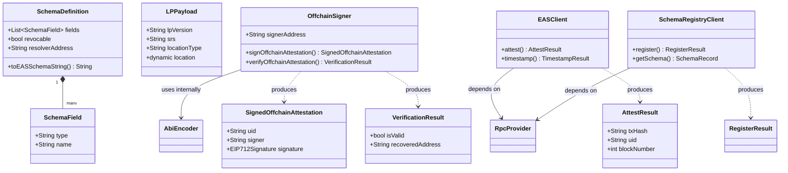

# API Reference

Complete reference for all publicly exported classes and types in `location_protocol`.

---

## LP Layer

## LPPayload

The core LP payload containing the 4 required base fields. Validates all fields on construction. See [LP data model spec](https://spec.decentralizedgeo.org/specification/data-model/).

**Constructor**

`LPPayload({required String lpVersion, required String srs, required String locationType, required dynamic location, bool validateLocation = true})`

Throws `ArgumentError` if any field is invalid (version format, empty/missing SRS, missing location, unknown location type).

**Properties**

| Property | Type | Description |
|---|---|---|
| `lpVersion` | `String` | Semver version string (e.g. `"1.0.0"`) |
| `srs` | `String` | Spatial Reference System URI |
| `locationType` | `String` | Location format identifier (e.g. `"geojson-point"`) |
| `location` | `dynamic` | Location data — `String`, `List`, or `Map` |
| `validateLocation` | `bool` | Whether to run `LocationValidator` on construction (default `true`) |

---

## LPVersion

Static class providing LP spec version constants and semver validation.

**Static properties / methods**

| Name | Type | Description |
|---|---|---|
| `current` | `String` (const) | Current LP spec version: `"1.0.0"` |
| `semverPattern` | `RegExp` | Regex matching `major.minor.patch` (digits only) |
| `isValid(String version)` | `bool` | Returns `true` if `version` matches `semverPattern` |

---

## LocationSerializer

Static utility class. Serializes location values to ABI-compatible strings.

**Static methods**

| Method | Parameters | Returns | Description |
|---|---|---|---|
| `serialize(dynamic location)` | `location: dynamic` | `String` | Returns `String` unchanged; JSON-encodes `List` or `Map`; throws `ArgumentError` for any other type |

---

## LocationValidator

Static class for validating location values against declared location types. See [LocationTypes spec](https://spec.decentralizedgeo.org/specification/location-types/).

**Static properties**

| Property | Type | Description |
|---|---|---|
| `knownLocationTypes` | `Set<String>` (const) | The 9 canonical LP location types: `coordinate-decimal+lon-lat`, `geojson-point`, `geojson-line`, `geojson-polygon`, `h3`, `geohash`, `wkt`, `address`, `scaledCoordinates` |

**Static methods**

| Method | Parameters | Returns | Description |
|---|---|---|---|
| `validate(String locationType, dynamic location)` | `locationType: String`, `location: dynamic` | `void` | Throws `ArgumentError` if type is unknown or value does not match expected shape |
| `register(String locationType, void Function(dynamic) validator)` | `locationType: String`, `validator: void Function(dynamic)` | `void` | Registers a custom type validator. Built-in types cannot be overridden; duplicate registrations replace the previous validator |
| `resetCustomTypes()` | — | `void` | Clears all custom type registrations. For testing only |

---

## Schema Layer

## SchemaField

A single ABI field definition consisting of a Solidity type and a field name.

**Constructor**

`SchemaField({required String type, required String name})`

Throws `ArgumentError` if `type` or `name` is empty.

**Properties**

| Property | Type | Description |
|---|---|---|
| `type` | `String` | Solidity ABI type (e.g. `"uint256"`, `"string"`, `"address"`) |
| `name` | `String` | Field name (e.g. `"timestamp"`, `"memo"`) |

**Methods**

| Method | Parameters | Returns | Description |
|---|---|---|---|
| `toString()` | — | `String` | Returns `"type name"` (e.g. `"uint256 timestamp"`) |
| `==` | `Object other` | `bool` | Value equality on `type` and `name` |
| `hashCode` | — | `int` | Hash of `type` and `name` |

---

## SchemaDefinition

User schema with automatic LP base field injection. See [EAS schemas](https://docs.attest.org/docs/core--concepts/schemas).

LP fields (`lp_version`, `srs`, `location_type`, `location`) are automatically prepended to the schema string. User field names that collide with reserved LP names throw `ArgumentError`.

**Constructor**

`SchemaDefinition({required List<SchemaField> fields, bool revocable = true, String resolverAddress = '0x0000000000000000000000000000000000000000'})`

**Static properties**

| Property | Type | Description |
|---|---|---|
| `lpFields` | `List<SchemaField>` | The 4 injected LP fields, all typed `string`: `lp_version`, `srs`, `location_type`, `location` |

**Instance properties**

| Property | Type | Description |
|---|---|---|
| `fields` | `List<SchemaField>` | User-defined business fields |
| `revocable` | `bool` | Whether attestations can be revoked (default `true`) |
| `resolverAddress` | `String` | Optional resolver contract address (default zero address) |
| `allFields` | `List<SchemaField>` | `lpFields` followed by `fields` — the full ordered field list |

**Methods**

| Method | Parameters | Returns | Description |
|---|---|---|---|
| `toEASSchemaString()` | — | `String` | Comma-separated `"type name"` pairs for all fields, LP fields first |

---

## SchemaUID

Deterministic schema UID computation matching EAS on-chain behavior.

Formula: `keccak256(abi.encodePacked(schemaString, resolverAddress, revocable))`

**Static methods**

| Method | Parameters | Returns | Description |
|---|---|---|---|
| `compute(SchemaDefinition schema)` | `schema: SchemaDefinition` | `String` | `0x`-prefixed 64-character hex string (32 bytes) |

---

## EAS Layer

## EASConstants

Static class holding EAS protocol constants.

**Static constants**

| Name | Type | Value | Description |
|---|---|---|---|
| `zeroAddress` | `String` | `"0x0000000000000000000000000000000000000000"` | Ethereum zero address |
| `zeroBytes32` | `String` | `"0x0000...0000"` (64 hex chars) | 32-byte zero value |
| `saltSize` | `int` | `32` | Salt size in bytes |
| `attestationVersion` | `int` | `2` | Offchain attestation version (Version 2 includes salt) |
| `eip712DomainName` | `String` | `"EAS Attestation"` | EIP-712 domain name used by EAS |
| `attestedEventTopic` | `String` | `"0x8bf46bf4..."` | keccak256 of `"Attested(address,address,bytes32,bytes32)"` |
| `timestampedEventTopic` | `String` | `"0x5aafceeb..."` | keccak256 of `"Timestamped(bytes32,uint64)"` |

**Static methods**

| Method | Parameters | Returns | Description |
|---|---|---|---|
| `generateSalt()` | — | `Uint8List` | Generates a 32-byte cryptographically secure random salt |
| `saltToHex(Uint8List salt)` | `salt: Uint8List` | `String` | Converts a salt to a `0x`-prefixed hex string |

---

## AbiEncoder

Schema-aware ABI encoder for LP attestation payloads.

**Static methods**

| Method | Parameters | Returns | Description |
|---|---|---|---|
| `encode({required SchemaDefinition schema, required LPPayload lpPayload, required Map<String, dynamic> userData})` | `schema`, `lpPayload`, `userData` | `Uint8List` | ABI-encodes LP fields followed by user fields. Throws `ArgumentError` for missing or extra `userData` keys |

The encoding order matches `SchemaDefinition.allFields`: LP fields first (`lp_version`, `srs`, `location_type`, `location`), then user fields in declaration order. `lpPayload.location` is serialized via `LocationSerializer` before encoding.

---

## OffchainSigner

EIP-712 v2 offchain attestation signing and verification. No RPC connection required. See [EIP-712](https://eips.ethereum.org/EIPS/eip-712).

**Constructor**

`OffchainSigner({required String privateKeyHex, required int chainId, required String easContractAddress, String easVersion = '1.0.0'})`

**Properties**

| Property | Type | Description |
|---|---|---|
| `signerAddress` | `String` | Ethereum address derived from the private key |
| `chainId` | `int` | Chain ID the signer is configured for |
| `easContractAddress` | `String` | EAS contract address used in the EIP-712 domain |
| `easVersion` | `String` | EAS version string used in the EIP-712 domain (default `"1.0.0"`) |

**Methods**

| Method | Parameters | Returns | Description |
|---|---|---|---|
| `signOffchainAttestation({...})` | `required schema: SchemaDefinition`, `required lpPayload: LPPayload`, `required userData: Map<String, dynamic>`, `recipient: String = zeroAddress`, `time: BigInt?`, `expirationTime: BigInt?`, `refUID: String?`, `salt: Uint8List?` | `Future<SignedOffchainAttestation>` | Signs an offchain attestation using EIP-712 typed data. Generates a random salt if none provided |
| `verifyOffchainAttestation(SignedOffchainAttestation attestation)` | `attestation: SignedOffchainAttestation` | `VerificationResult` | Recovers the signer address and validates the UID. Synchronous |

---

## EASClient

Onchain EAS operations via EIP-1559 transactions. See [EAS contracts](https://docs.attest.org/docs/core--concepts/how-eas-works).

**Constructor**

`EASClient({required RpcProvider provider, String? easAddress})`

If `easAddress` is omitted, the address is resolved from `ChainConfig` using `provider.chainId`. Throws `StateError` if the chain is not in `ChainConfig`.

**Properties**

| Property | Type | Description |
|---|---|---|
| `provider` | `RpcProvider` | The RPC provider used for transactions and calls |
| `easAddress` | `String` | Resolved EAS contract address |

**Static methods**

| Method | Parameters | Returns | Description |
|---|---|---|---|
| `buildTimestampCallData(String uid)` | `uid: String` | `Uint8List` | ABI-encodes call data for `EAS.timestamp(bytes32)` |
| `buildAttestCallData({...})` | `required schema`, `required lpPayload`, `required userData`, `recipient: String = zeroAddress`, `expirationTime: BigInt?`, `refUID: String?` | `Uint8List` | ABI-encodes call data for `EAS.attest(AttestationRequest)` |

**Instance methods**

| Method | Parameters | Returns | Description |
|---|---|---|---|
| `attest({...})` | `required schema: SchemaDefinition`, `required lpPayload: LPPayload`, `required userData: Map<String, dynamic>`, `recipient: String = zeroAddress`, `expirationTime: BigInt?`, `refUID: String?` | `Future<AttestResult>` | Submits an onchain attestation. Requires the schema to already be registered |
| `timestamp(String offchainUID)` | `offchainUID: String` | `Future<TimestampResult>` | Timestamps an offchain attestation UID onchain for proof of existence |
| `getAttestation(String uid)` | `uid: String` | `Future<Attestation?>` | Fetches an onchain attestation by UID. Returns `null` if not found |
| `registerSchema(SchemaDefinition schema)` | `schema: SchemaDefinition` | `Future<RegisterResult>` | Convenience wrapper around `SchemaRegistryClient.register()` |

---

## SchemaRegistryClient

EAS Schema Registry on-chain operations.

**Constructor**

`SchemaRegistryClient({required RpcProvider provider, String? schemaRegistryAddress})`

If `schemaRegistryAddress` is omitted, the address is resolved from `ChainConfig`. Throws `StateError` if the chain is not in `ChainConfig`.

**Properties**

| Property | Type | Description |
|---|---|---|
| `provider` | `RpcProvider` | The RPC provider used for transactions and calls |
| `contractAddress` | `String` | Resolved SchemaRegistry contract address |

**Static methods**

| Method | Parameters | Returns | Description |
|---|---|---|---|
| `buildRegisterCallData(SchemaDefinition schema)` | `schema: SchemaDefinition` | `Uint8List` | ABI-encodes call data for `register(string,address,bool)`. No RPC needed |
| `computeSchemaUID(SchemaDefinition schema)` | `schema: SchemaDefinition` | `String` | Computes the deterministic schema UID locally. No RPC needed |

**Instance methods**

| Method | Parameters | Returns | Description |
|---|---|---|---|
| `register(SchemaDefinition schema)` | `schema: SchemaDefinition` | `Future<RegisterResult>` | Registers a schema on-chain and returns the transaction hash and UID |
| `getSchema(String uid)` | `uid: String` | `Future<SchemaRecord?>` | Fetches a schema record by UID. Returns `null` if not found |

---

## Config

## ChainConfig

Static class providing known EAS contract addresses keyed by chain ID.

**Static methods**

| Method | Parameters | Returns | Description |
|---|---|---|---|
| `forChainId(int chainId)` | `chainId: int` | `ChainAddresses?` | Returns addresses for the given chain ID, or `null` if unknown |
| `supportedChainIds` (getter) | — | `List<int>` | All chain IDs with known addresses (1, 11155111, 8453, 42161) |

Supported chains: Ethereum Mainnet (1), Sepolia (11155111), Base (8453), Arbitrum One (42161).

---

## ChainAddresses

Contract addresses and metadata for a specific EVM chain.

**Properties**

| Property | Type | Description |
|---|---|---|
| `eas` | `String` | EAS contract address |
| `schemaRegistry` | `String` | SchemaRegistry contract address |
| `chainName` | `String` | Human-readable chain name (e.g. `"Sepolia"`) |

---

## RPC Layer

## RpcProvider

Abstract interface for blockchain interaction. Implement this interface to provide a custom transport layer.

**Abstract properties**

| Property | Type | Description |
|---|---|---|
| `signerAddress` | `String` | Ethereum address of the configured signer |
| `chainId` | `int` | Chain ID the provider is connected to |

**Abstract methods**

| Method | Parameters | Returns | Description |
|---|---|---|---|
| `sendTransaction({required String to, required Uint8List data, BigInt? value})` | `to: String`, `data: Uint8List`, `value: BigInt?` | `Future<String>` | Sends a signed transaction; returns the transaction hash |
| `callContract({required String contractAddress, required AbiFunctionFragment function, List<dynamic> params = const []})` | `contractAddress`, `function`, `params` | `Future<List<dynamic>>` | Executes a read-only `eth_call`; returns decoded output values |
| `waitForReceipt(String txHash, {Duration? timeout, Duration pollInterval = 4s})` | `txHash: String`, `timeout: Duration?`, `pollInterval: Duration` | `Future<TransactionReceipt>` | Polls until the transaction is mined. Throws `TimeoutException` if `timeout` elapses |
| `close()` | — | `void` | Closes underlying HTTP or transport resources |

---

## DefaultRpcProvider

Default EIP-1559 JSON-RPC provider using `dart:io`. Implements `RpcProvider`.

**Constructor**

`DefaultRpcProvider({required String rpcUrl, required String privateKeyHex, required int chainId, Duration receiptTimeout = const Duration(minutes: 2)})`

**Properties**

| Property | Type | Description |
|---|---|---|
| `rpcUrl` | `String` | JSON-RPC endpoint URL |
| `chainId` | `int` | Chain ID (used for EIP-1559 transaction signing) |
| `receiptTimeout` | `Duration` | Maximum time to poll for transaction receipt (default 2 minutes) |
| `signerAddress` | `String` | Ethereum address derived from the private key |

---

## TransactionReceipt

A minimal transaction receipt returned by `RpcProvider.waitForReceipt()`.

**Properties**

| Property | Type | Description |
|---|---|---|
| `txHash` | `String` | Transaction hash (`0x`-prefixed, 66 chars) |
| `blockNumber` | `int` | Block number in which the transaction was mined |
| `status` | `bool?` | `true` = success, `false` = reverted, `null` = pre-Byzantium |
| `logs` | `List<TransactionLog>` | Event logs emitted during the transaction |

---

## TransactionLog

A single event log entry from a transaction receipt.

**Properties**

| Property | Type | Description |
|---|---|---|
| `address` | `String` | Contract address that emitted the event |
| `topics` | `List<String>` | Event topics; `topics[0]` is the keccak256 event signature hash |
| `data` | `String` | Hex-encoded non-indexed event parameters |

---

## Models

## SignedOffchainAttestation

A signed offchain EAS attestation with EIP-712 signature, produced by `OffchainSigner.signOffchainAttestation()`.

**Properties**

| Property | Type | Description |
|---|---|---|
| `uid` | `String` | Deterministic offchain UID (`0x`-prefixed) |
| `schemaUID` | `String` | Schema UID this attestation conforms to |
| `recipient` | `String` | Recipient address (may be zero address) |
| `time` | `BigInt` | Attestation creation time (Unix seconds) |
| `expirationTime` | `BigInt` | Expiration time (`0` = never) |
| `revocable` | `bool` | Whether this attestation can be revoked |
| `refUID` | `String` | Reference to another attestation UID (zero bytes32 for none) |
| `data` | `Uint8List` | ABI-encoded data payload |
| `salt` | `String` | Random 32-byte salt as `0x`-prefixed hex string |
| `version` | `int` | Offchain attestation version (`2`) |
| `signature` | `EIP712Signature` | EIP-712 ECDSA signature |
| `signer` | `String` | Ethereum address of the signer |

---

## UnsignedAttestation

The attestation data payload before signing.

**Properties**

| Property | Type | Description |
|---|---|---|
| `schemaUID` | `String` | Schema UID this attestation conforms to |
| `recipient` | `String` | Recipient address (may be zero address) |
| `time` | `BigInt` | Attestation creation time (Unix seconds) |
| `expirationTime` | `BigInt` | Expiration time (`0` = never) |
| `revocable` | `bool` | Whether this attestation can be revoked |
| `refUID` | `String` | Reference UID (zero bytes32 for none) |
| `data` | `Uint8List` | ABI-encoded data payload |

---

## Attestation

A record representing an on-chain attestation, returned by `EASClient.getAttestation()`.

**Properties**

| Property | Type | Description |
|---|---|---|
| `uid` | `String` | Attestation UID (`0x`-prefixed) |
| `schema` | `String` | Schema UID this attestation conforms to |
| `time` | `BigInt` | Attestation creation time (Unix seconds) |
| `expirationTime` | `BigInt` | Expiration time (`0` = never) |
| `revocationTime` | `BigInt` | Revocation time (`0` = not revoked) |
| `refUID` | `String` | Reference UID (zero bytes32 for none) |
| `recipient` | `String` | Recipient address |
| `attester` | `String` | Attester address |
| `revocable` | `bool` | Whether this attestation can be revoked |
| `data` | `Uint8List` | ABI-encoded data payload |

**Factory constructors**

| Constructor | Parameters | Description |
|---|---|---|
| `Attestation.fromTuple(List<dynamic> decoded)` | `decoded: List<dynamic>` | Constructs from the ABI-decoded tuple returned by `eth_call` |

---

## EIP712Signature

An EIP-712 ECDSA signature with `v`, `r`, `s` components.

**Properties**

| Property | Type | Description |
|---|---|---|
| `v` | `int` | Recovery id (27 or 28) |
| `r` | `String` | The `r` component as a `0x`-prefixed hex string |
| `s` | `String` | The `s` component as a `0x`-prefixed hex string |

---

## VerificationResult

Result of verifying an offchain attestation signature, produced by `OffchainSigner.verifyOffchainAttestation()`.

**Properties**

| Property | Type | Description |
|---|---|---|
| `isValid` | `bool` | `true` if the signature is valid and the UID matches |
| `recoveredAddress` | `String` | Ethereum address recovered from the signature |
| `reason` | `String?` | Failure reason if `isValid` is `false`; `null` on success |

---

## AttestResult

Result of `EASClient.attest()` after the transaction is mined.

**Properties**

| Property | Type | Description |
|---|---|---|
| `txHash` | `String` | Transaction hash (`0x`-prefixed, 66 chars) |
| `uid` | `String` | keccak256 UID of the new onchain attestation (`0x`-prefixed, 66 chars) |
| `blockNumber` | `int` | Block number in which the transaction was mined |

---

## RegisterResult

Result of `SchemaRegistryClient.register()` after the transaction is broadcast.

**Properties**

| Property | Type | Description |
|---|---|---|
| `txHash` | `String` | Transaction hash (`0x`-prefixed, 66 chars) |
| `uid` | `String` | Deterministic schema UID (`0x`-prefixed, 66 chars), computed locally |

---

## TimestampResult

Result of `EASClient.timestamp()` after the transaction is mined.

**Properties**

| Property | Type | Description |
|---|---|---|
| `txHash` | `String` | Transaction hash (`0x`-prefixed, 66 chars) |
| `uid` | `String` | Offchain attestation UID that was anchored (`0x`-prefixed, 66 chars) |
| `time` | `BigInt` | `block.timestamp` (uint64) at which the anchoring occurred |

---

## SchemaRecord

A schema record returned by `SchemaRegistryClient.getSchema()`.

**Properties**

| Property | Type | Description |
|---|---|---|
| `uid` | `String` | Schema UID (`0x`-prefixed) |
| `resolver` | `String` | Resolver contract address |
| `revocable` | `bool` | Whether attestations using this schema are revocable |
| `schema` | `String` | The raw EAS schema string (e.g. `"string lp_version,string srs,..."`) |

**Factory constructors**

| Constructor | Parameters | Description |
|---|---|---|
| `SchemaRecord.fromTuple(List<dynamic> decoded)` | `decoded: List<dynamic>` | Constructs from the ABI-decoded tuple returned by `eth_call`. Throws `ArgumentError` if the list has fewer than 4 elements |
