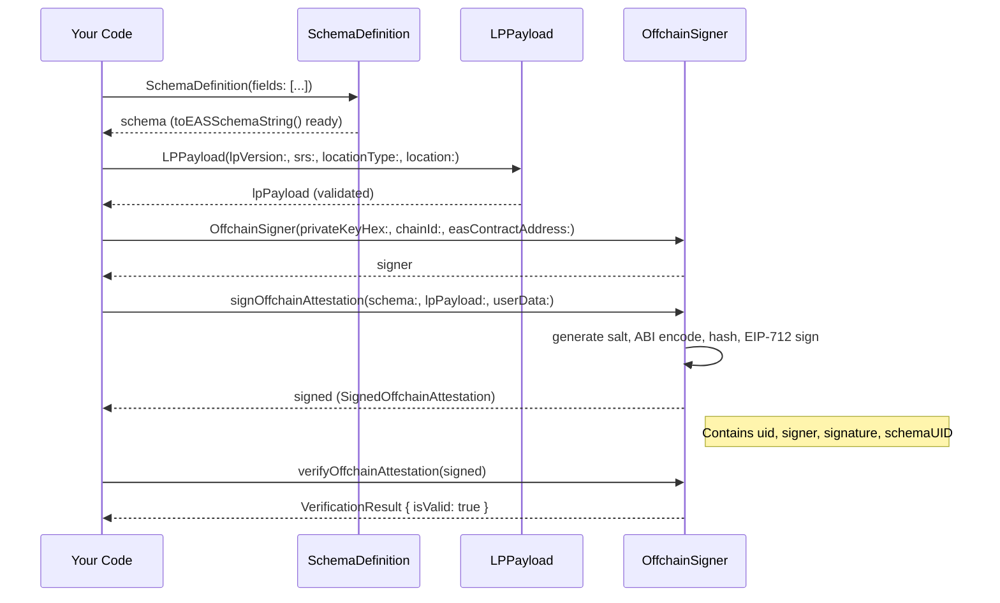

# Build your first Location Protocol attestation

In this tutorial, you will create, sign, and verify a Location Protocol attestation entirely offline — no network connection required. By the end, you will have a fully formed `SignedOffchainAttestation` object with a unique UID and a verified signature. No prior EAS or blockchain experience is needed.

## Prerequisites

- Dart ≥ 3.11 ([install](https://dart.dev/get-dart))
- `location_protocol` added to `pubspec.yaml` (see [Installation](../../README.md#installation))

---

## Flow overview

Before you start, here is the complete flow you will build:



---

Each step adds code to a single `main()` function. The **[complete program listing](#complete-program-listing)** at the end of this tutorial shows the full program — you can jump straight there if you prefer to read ahead.

## Step 1 — Define your schema

A schema defines the structure of your attestation data. Here you add two business fields; the library will automatically prepend the four LP base fields.

```dart
import 'package:location_protocol/location_protocol.dart';

void main() async {
  // Define your business schema
  // LP base fields (lp_version, srs, location_type, location) are auto-prepended
  final schema = SchemaDefinition(
    fields: [
      SchemaField(type: 'uint256', name: 'timestamp'),
      SchemaField(type: 'string', name: 'memo'),
    ],
  );

  print(schema.toEASSchemaString());
  // => "string lp_version,string srs,string location_type,string location,uint256 timestamp,string memo"
}
```

**Expected output:**

```
string lp_version,string srs,string location_type,string location,uint256 timestamp,string memo
```

---

## Step 2 — Create an LP payload

An LP payload carries the four base fields that every Location Protocol attestation must include.

Add the following inside `main`, after the schema definition from Step 1:

> **Note:** All steps build up a single `main()` function. The complete listing at the end shows the full program.

```dart
  // Create the LP payload — validates all 4 base fields on construction
  final lpPayload = LPPayload(
    lpVersion: '1.0.0',
    srs: 'http://www.opengis.net/def/crs/OGC/1.3/CRS84',           // OGC CRS URI
    locationType: 'geojson-point',
    location: {'type': 'Point', 'coordinates': [-103.771556, 44.967243]},
  );

  print('Location type: ${lpPayload.locationType}');
  print('Location: ${lpPayload.location}');
  // If LPPayload construction succeeds, all 4 fields are valid.
```

**Expected output:**

```
Location type: geojson-point
Location: {type: Point, coordinates: [-103.771556, 44.967243]}
```

---

## Step 3 — Sign the attestation offchain

Offchain signing uses EIP-712 typed data — the result is verifiable by anyone with your public address, without touching the blockchain.

Still inside `main`, add the following after `lpPayload`:

```dart
  // A test private key — NEVER use a real key in source code
  const testPrivateKey = '1234567890abcdef1234567890abcdef1234567890abcdef1234567890abcdef';
  const chainId = 11155111; // Sepolia

  final easAddress = ChainConfig.forChainId(chainId)!.eas;

  final signer = OffchainSigner(
    privateKeyHex: testPrivateKey,
    chainId: chainId,
    easContractAddress: easAddress,
  );

  final signed = await signer.signOffchainAttestation(
    schema: schema,
    lpPayload: lpPayload,
    userData: {
      'timestamp': BigInt.from(DateTime.now().millisecondsSinceEpoch ~/ 1000),
      'memo': 'Tutorial checkpoint',
    },
  );

  print('Attestation UID: ${signed.uid}');
  print('Signer:          ${signed.signer}');
```

**Expected output pattern:**

```
Attestation UID: 0x<64 hex chars>
Signer:          0x<40 hex chars>
```

> **Note:** The UID is different every time you run this, even with the same inputs. This is by design — the CSPRNG salt in EAS offchain attestation version 2 makes each UID globally unique.

---

## Step 4 — Verify the attestation

Add the following after the `signed` variable:

```dart
  final result = signer.verifyOffchainAttestation(signed);

  print('Valid:            ${result.isValid}');
  print('Recovered signer: ${result.recoveredAddress}');

  // The recovered address should match the signer's address
  assert(result.isValid, 'Signature verification failed');
  assert(
    result.recoveredAddress.toLowerCase() == signer.signerAddress.toLowerCase(),
    'Recovered address mismatch',
  );
```

**Expected output:**

```
Valid:            true
Recovered signer: 0x<same hex chars as Signer above>
```

---

## Step 5 — Inspect the signed attestation

Finally, add the following after the verification:

```dart
  // Inspect the full signed attestation
  print('Schema UID: ${signed.schemaUID}');
  print('Version:    ${signed.version}');
  print('Revocable:  ${signed.revocable}');
  print('r: ${signed.signature.r}');
  print('s: ${signed.signature.s}');
  print('v: ${signed.signature.v}');
```

**Expected output pattern:**

```
Schema UID: 0x<64 hex chars>
Version:    2
Revocable:  true
r: 0x<64 hex chars>
s: 0x<64 hex chars>
v: 27   (or 28)
```

---

## Complete program listing

Copy this into `bin/tutorial.dart` and run with `dart run bin/tutorial.dart`:

```dart
import 'package:location_protocol/location_protocol.dart';

void main() async {
  // Step 1 — Define your schema
  // LP base fields (lp_version, srs, location_type, location) are auto-prepended
  final schema = SchemaDefinition(
    fields: [
      SchemaField(type: 'uint256', name: 'timestamp'),
      SchemaField(type: 'string', name: 'memo'),
    ],
  );

  print(schema.toEASSchemaString());
  // => "string lp_version,string srs,string location_type,string location,uint256 timestamp,string memo"

  // Step 2 — Create the LP payload
  final lpPayload = LPPayload(
    lpVersion: '1.0.0',
    srs: 'http://www.opengis.net/def/crs/OGC/1.3/CRS84',
    locationType: 'geojson-point',
    location: {'type': 'Point', 'coordinates': [-103.771556, 44.967243]},
  );

  print('Location type: ${lpPayload.locationType}');
  print('Location: ${lpPayload.location}');

  // Step 3 — Sign the attestation offchain
  // A test private key — NEVER use a real key in source code
  const testPrivateKey = '1234567890abcdef1234567890abcdef1234567890abcdef1234567890abcdef';
  const chainId = 11155111; // Sepolia

  final easAddress = ChainConfig.forChainId(chainId)!.eas;

  final signer = OffchainSigner(
    privateKeyHex: testPrivateKey,
    chainId: chainId,
    easContractAddress: easAddress,
  );

  final signed = await signer.signOffchainAttestation(
    schema: schema,
    lpPayload: lpPayload,
    userData: {
      'timestamp': BigInt.from(DateTime.now().millisecondsSinceEpoch ~/ 1000),
      'memo': 'Tutorial checkpoint',
    },
  );

  print('Attestation UID: ${signed.uid}');
  print('Signer:          ${signed.signer}');

  // Step 4 — Verify the attestation
  final result = signer.verifyOffchainAttestation(signed);

  print('Valid:            ${result.isValid}');
  print('Recovered signer: ${result.recoveredAddress}');

  assert(result.isValid, 'Signature verification failed');
  assert(
    result.recoveredAddress.toLowerCase() == signer.signerAddress.toLowerCase(),
    'Recovered address mismatch',
  );

  // Step 5 — Inspect the signed attestation
  print('Schema UID: ${signed.schemaUID}');
  print('Version:    ${signed.version}');
  print('Revocable:  ${signed.revocable}');
  print('r: ${signed.signature.r}');
  print('s: ${signed.signature.s}');
  print('v: ${signed.signature.v}');
}
```

---

## What's next

Your `SignedOffchainAttestation` is ready to share, store, or anchor on-chain. Here are your next steps:

- [Register a schema and attest onchain](how-to-register-and-attest-onchain.md)
- [API reference — OffchainSigner](reference-api.md#ofchainsigner)
- [Concepts: Offchain vs onchain attestations](explanation-concepts.md#4-offchain-vs-onchain-attestations)
