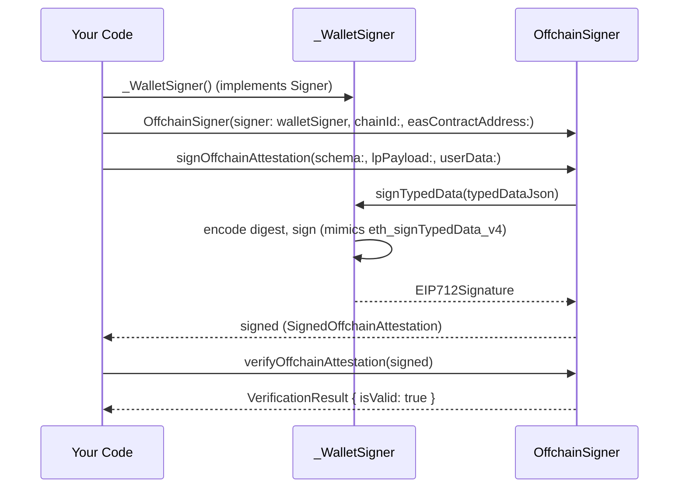

# Sign attestations with an external wallet signer

In this tutorial, you will implement a custom `Signer`, wire it into `OffchainSigner`, and produce a verified offchain attestation — without the library ever accessing a raw private key directly. By the end, you will have a working `_WalletSigner` class that mirrors the pattern used by Privy, MetaMask, and WalletConnect integrations.

## Prerequisites

- Completed [Build your first LP attestation](tutorial-first-attestation.md)
- Dart ≥ 3.11 ([install](https://dart.dev/get-dart))
- `location_protocol` added to `pubspec.yaml` (see [Installation](../../README.md#installation))

---

## Flow overview



---

Each step adds code to a single `main()` function. The **[complete program listing](#complete-program-listing)** at the end shows the full runnable program.

## Step 1 — Implement the `Signer` interface

Create a class that `extends Signer`. Wallet-backed signers override `signTypedData` — the method that receives the full EIP-712 JSON and returns a parsed signature. The `signDigest` method is left intentionally unreachable because a wallet never receives a pre-hashed digest.

In a real wallet integration, `signTypedData` would call your SDK (e.g., `privy.signTypedData(...)` or `provider.request('eth_signTypedData_v4', [...])`). Here we simulate that by doing the digest computation and signing locally, exactly as a wallet does internally.

The `_WalletSigner` class definition lives outside `main()`. Place it at the top of your program file:

> ```dart
> import 'dart:typed_data';
> import 'package:location_protocol/location_protocol.dart';
> import 'package:on_chain/ethereum/src/models/eip712/typed_data.dart';
>
> // Simulated wallet signer — mirrors the pattern for real wallet SDK integrations.
> // In production, replace the signTypedData body with your wallet SDK call.
> class _WalletSigner extends Signer {
>   final String _privateKeyHex;
>   final ETHPrivateKey _privateKey;
>
>   _WalletSigner(this._privateKeyHex)
>       : _privateKey = ETHPrivateKey(_privateKeyHex);
>
>   @override
>   String get address =>
>       EthereumAddress.fromPrivateKey(_privateKey).toChecksumAddress();
>
>   // Override signTypedData to simulate eth_signTypedData_v4:
>   // reconstruct the typed data, encode the digest, sign it.
>   @override
>   Future<EIP712Signature> signTypedData(
>       Map<String, dynamic> typedData) async {
>     final eip712 = Eip712TypedData.fromJson(typedData);
>     final digest = eip712.encode();
>     final rawSig = _privateKey.sign(digest, hashMessage: false);
>     // Wallet SDKs return a 0x-prefixed 65-byte hex string:
>     final hexSig = '0x${BytesUtils.toHexString(rawSig)}';
>     return EIP712Signature.fromHex(hexSig);
>   }
>
>   @override
>   Future<EIP712Signature> signDigest(Uint8List digest) =>
>       throw UnsupportedError(
>           'Wallet signers use signTypedData — signDigest is not reachable.');
> }
> ```

**What you have:** A `_WalletSigner` that overrides only `signTypedData`, uses `EIP712Signature.fromHex()` to parse the result, and throws on `signDigest` to prove it is never called.

---

## Step 2 — Wire the signer into `OffchainSigner`

Pass your `_WalletSigner` directly to the primary `OffchainSigner` constructor. No private key string is involved at this level. Add the following inside `main`, after the imports and class definition:

```dart
  // Replace with your wallet-backed Signer implementation:
  const privateKeyHex =
      'ac0974bec39a17e36ba4a6b4d238ff944bacb478cbed5efcae784d7bf4f2ff80';

  final walletSigner = LocalKeySigner(privateKeyHex: privateKeyHex);

  final chainId = 11155111; // Sepolia
  final easAddress = ChainConfig.forChainId(chainId)!.eas;

  final offchainSigner = OffchainSigner(
    signer: walletSigner,
    chainId: chainId,
    easContractAddress: easAddress,
  );

  print('Signer address: ${offchainSigner.signerAddress}');
  // => Signer address: 0xf39Fd6e51aad88F6F4ce6aB8827279cffFb92266
```

**What you have:** An `OffchainSigner` wired to your wallet without any raw key in its own constructor.

---

## Step 3 — Sign and verify an attestation

Build a schema and payload, then sign and verify exactly as in the basic tutorial. The signing path goes through your signer's `signTypedData` — the library never calls `signDigest`. Add the following after `offchainSigner`:

```dart
  final schema = SchemaDefinition(
    fields: [SchemaField(type: 'string', name: 'memo')],
  );

  final lpPayload = LPPayload(
    lpVersion: '1.0.0',
    srs: 'http://www.opengis.net/def/crs/OGC/1.3/CRS84',
    locationType: 'geojson-point',
    location: {'type': 'Point', 'coordinates': [-73.9857, 40.7484]},
  );

  final signed = await offchainSigner.signOffchainAttestation(
    schema: schema,
    lpPayload: lpPayload,
    userData: {'memo': 'Signed via wallet adapter'},
  );

  print('UID:    ${signed.uid}');
  print('Signer: ${signed.signer}');

  final result = offchainSigner.verifyOffchainAttestation(signed);
  print('Valid:  ${result.isValid}');
  // => Valid:  true
```

**What you have:** A `SignedOffchainAttestation` signed by your wallet-backed signer and verified successfully.

---

## Complete program listing

The listing below uses `LocalKeySigner` as a drop-in stand-in for a wallet adapter. To use a real wallet SDK, replace `LocalKeySigner` with your own `extends Signer` subclass as shown in Step 1.

```dart
import 'package:location_protocol/location_protocol.dart';

void main() async {
  const privateKeyHex =
      'ac0974bec39a17e36ba4a6b4d238ff944bacb478cbed5efcae784d7bf4f2ff80';

  // In production: replace with your wallet-backed Signer implementation.
  final walletSigner = LocalKeySigner(privateKeyHex: privateKeyHex);
  final chainId = 11155111;
  final easAddress = ChainConfig.forChainId(chainId)!.eas;

  final offchainSigner = OffchainSigner(
    signer: walletSigner,
    chainId: chainId,
    easContractAddress: easAddress,
  );

  final schema = SchemaDefinition(
    fields: [SchemaField(type: 'string', name: 'memo')],
  );

  final lpPayload = LPPayload(
    lpVersion: '1.0.0',
    srs: 'http://www.opengis.net/def/crs/OGC/1.3/CRS84',
    locationType: 'geojson-point',
    location: {'type': 'Point', 'coordinates': [-73.9857, 40.7484]},
  );

  final signed = await offchainSigner.signOffchainAttestation(
    schema: schema,
    lpPayload: lpPayload,
    userData: {'memo': 'Signed via wallet adapter'},
  );

  print('UID:    ${signed.uid}');
  print('Signer: ${signed.signer}');

  final result = offchainSigner.verifyOffchainAttestation(signed);
  print('Valid:  ${result.isValid}');
}
```

---

## What's next

- [Concepts: The Signer interface and wallet integration](explanation-concepts.md#7-the-signer-interface-and-wallet-integration)
- [How to build a wallet-based onchain attestation](how-to-wallet-onchain-attest.md)
- [API reference — Signer](reference-api.md#signer)
- [API reference — OffchainSigner](reference-api.md#offchainsigner)
